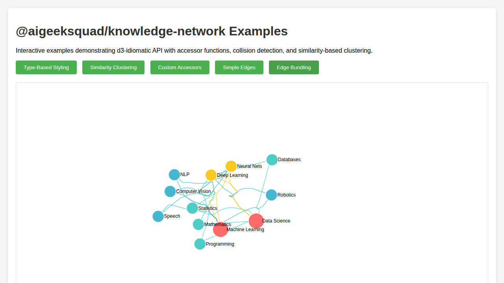

# KnowledgeGraphRenderer

A modern TypeScript library extending d3.js for creating interactive knowledge graph visualizations.

## 📦 Packages

This monorepo contains the following packages:

- **[@aigeeksquad/knowledge-network](./packages/knowledge-network)** - Core library for knowledge graph visualization
- **[examples](./packages/examples)** - Interactive examples and demonstrations

## 🚀 Quick Start

### Installation

```bash
pnpm install
```

### Development

```bash
# Build all packages
pnpm build

# Run tests
pnpm test

# Start the examples in development mode
pnpm dev

# Lint all packages
pnpm lint

# Format code
pnpm format
```

## 📖 Usage

Install the library in your project:

```bash
npm install @aigeeksquad/knowledge-network d3
```

Basic usage:

```typescript
import { KnowledgeGraph } from '@aigeeksquad/knowledge-network';

const container = document.getElementById('graph');
const data = {
  nodes: [
    { id: 'A', label: 'Node A' },
    { id: 'B', label: 'Node B' },
  ],
  edges: [
    { source: 'A', target: 'B' },
  ],
};

const graph = new KnowledgeGraph(container, data);
graph.render();
```

For more detailed documentation, see the [library README](./packages/knowledge-network/README.md).

## 🎨 Visual Examples

### Edge Bundling

The library features advanced force-directed edge bundling that creates cleaner, more organic visualizations by grouping related edges together.

| Simple Edges | Edge Bundling |
|--------------|---------------|
|  |  |
| Straight lines between nodes | Smooth curved paths that reduce visual clutter |

Edge bundling is particularly effective for:
- Complex graphs with many parallel edges
- Visualizations where edge flow patterns are important
- Reducing visual clutter in dense networks

See the [Edge Bundling documentation](./packages/knowledge-network/README.md#edge-bundling) for configuration options and best practices.

## 🏗️ Project Structure

```
KnowledgeGraphRenderer/
├── packages/
│   ├── knowledge-network/    # Core library
│   │   ├── src/
│   │   │   ├── KnowledgeGraph.ts
│   │   │   ├── types.ts
│   │   │   ├── layout/
│   │   │   └── __tests__/
│   │   ├── package.json
│   │   ├── tsconfig.json
│   │   └── README.md
│   └── examples/             # Example applications
│       ├── src/
│       ├── index.html
│       └── package.json
├── pnpm-workspace.yaml
├── package.json
└── README.md
```

## 🧪 Testing

Tests are written using Vitest:

```bash
pnpm test
```

### Wallaby.js Support

For real-time test feedback in your IDE, Wallaby.js configuration files are included:
- Root configuration: `wallaby.js`
- Package configuration: `packages/knowledge-network/wallaby.js`

Simply install the Wallaby.js extension for your IDE and start it to see inline test results as you code.

## 📝 License

MIT © AIGeekSquad
