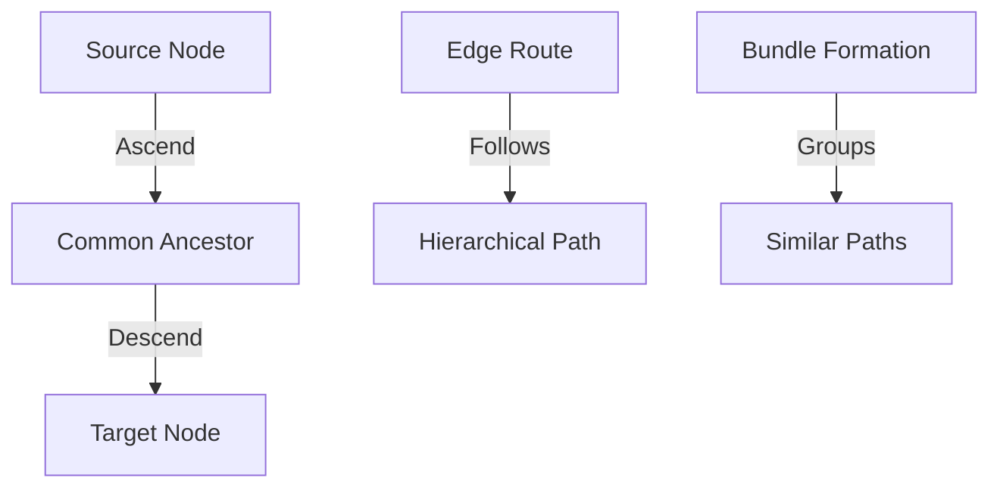

# Edge Bundling Techniques and Approaches in Graph Visualization: A Comprehensive Research Document for Knowledge and Mind Map Networks

**Version:** 1.0  
**Date:** October 2025  
**Context:** Research for the knowledge-network library

## Executive Summary

Edge bundling represents a fundamental advancement in graph visualization that addresses the persistent challenge of visual clutter in complex network displays. This comprehensive analysis examines theoretical foundations, algorithmic approaches, and performance characteristics of edge bundling techniques specifically tailored for knowledge graphs and mind map visualization. The research reveals that modern edge bundling methods have evolved from simple hierarchical approaches to sophisticated force-directed algorithms and AI-driven semantic approaches, each offering unique advantages for different graph structures and visualization requirements.

For knowledge and mind map networks, the key findings demonstrate that hierarchical edge bundling excels when clear taxonomic or ontological structures exist, while force-directed approaches provide superior results for densely interconnected conceptual networks. The integration of artificial intelligence and machine learning techniques, particularly embedding vectors and graph neural networks, represents a paradigmatic shift toward semantically-aware bundling that can understand conceptual relationships beyond geometric properties. Performance optimization through spatial data structures, GPU acceleration, multi-level algorithms, and AI-driven compatibility optimization enables interactive visualization of networks containing thousands of nodes and edges while maintaining semantic coherence. The combination of traditional geometric approaches with modern semantic embedding techniques significantly enhances the effectiveness of bundling for knowledge representation tasks, enabling visualizations that align with human cognitive models of conceptual organization.

## Table of Contents

1. [Introduction to Edge Bundling](#1-introduction-to-edge-bundling)
2. [AI-Driven Semantic Approaches for Knowledge Network Visualization](#2-ai-driven-semantic-approaches-for-knowledge-network-visualization)
3. [Node Layout Algorithms for Knowledge Graphs](#3-node-layout-algorithms-for-knowledge-graphs)
4. [Edge Compatibility Metrics and Bundling Criteria](#4-edge-compatibility-metrics-and-bundling-criteria)
5. [Bundling Algorithm Categories](#5-bundling-algorithm-categories)
6. [Smoothing Techniques for Bundled Edges](#6-smoothing-techniques-for-bundled-edges)
7. [Performance Considerations and Optimization](#7-performance-considerations-and-optimization)
8. [Knowledge Graph and Mind Map Specific Considerations](#8-knowledge-graph-and-mind-map-specific-considerations)
9. [Quality Assessment and Evaluation Methods](#9-quality-assessment-and-evaluation-methods)
10. [Implementation Recommendations](#10-implementation-recommendations)
11. [Future Directions and Research Opportunities](#11-future-directions-and-research-opportunities)
12. [Conclusion](#12-conclusion)
13. [References](#13-references)

## 1. Introduction to Edge Bundling

Edge bundling emerged as a solution to one of the most persistent challenges in graph visualization: the visual clutter that renders large networks incomprehensible to human observers. The technique fundamentally transforms traditional node-link representations by grouping similar edges into bundles, thereby reducing overall visual complexity while preserving essential structural information[^1][^2].

### 1.1 Theoretical Foundation

The theoretical foundation of edge bundling rests on the principle that human visual perception can better comprehend organized, bundled structures rather than individual overlapping elements scattered throughout the visualization space[^2]. This approach draws inspiration from practical engineering solutions, such as bundling electrical wires together to reduce clutter while maintaining their individual connectivity at endpoints[^3].

### 1.2 Core Principles

Edge bundling operates on multiple levels of abstraction, from low-level geometric considerations to high-level semantic relationships between graph entities. The technique must balance competing objectives:

- **Clutter Reduction**: Minimizing visual complexity through intelligent edge routing
- **Structural Preservation**: Maintaining the faithfulness of underlying network structure
- **Semantic Integrity**: Preserving meaningful relationships in knowledge representations
- **Interactive Performance**: Enabling real-time exploration and modification

### 1.3 Applications in Knowledge Networks

For knowledge graphs and mind maps, edge bundling provides particular advantages:

- **Conceptual Clarity**: Reveals high-level patterns in knowledge organization
- **Hierarchical Emphasis**: Highlights taxonomic and ontological relationships
- **Exploration Support**: Facilitates incremental disclosure of information
- **Cognitive Alignment**: Matches human mental models of knowledge structure

## 2. AI-Driven Semantic Approaches for Knowledge Network Visualization

The integration of artificial intelligence and machine learning techniques into graph visualization represents a paradigmatic shift from purely geometric approaches toward semantically-aware representation methods that can capture the rich conceptual relationships inherent in modern networked data[^26][^27]. For knowledge networks and mind maps, this transformation is particularly significant as AI-driven approaches can understand and leverage the semantic content that defines the very purpose of these visualization types.

### 2.1 Foundations of Embedding-Based Visualization for Knowledge Networks

Embedding vectors serve as dense, low-dimensional representations that capture semantic relationships between graph elements in continuous vector spaces, making them ideally suited for knowledge network visualization where conceptual similarity is paramount[^26][^28]. Unlike traditional geometric approaches that rely solely on structural properties, embedding-based methods can position semantically related concepts in proximity regardless of their structural distance in the graph, creating more intuitive layouts that align with human understanding of knowledge organization.

For mind maps specifically, embedding-based positioning enables the creation of layouts where related ideas naturally cluster together based on their conceptual similarity rather than arbitrary structural connections. This approach proves particularly effective for educational mind maps where pedagogical relationships and conceptual prerequisites can be encoded through specialized embeddings that capture learning progression and difficulty relationships[^29].

Knowledge graphs benefit from embedding approaches through their ability to preserve both structural and semantic properties simultaneously. Knowledge graph embeddings such as TransE, ComplEx, and RotatE can capture the semantic meaning of different relationship types while maintaining the graph's structural integrity[^30][^31]. This dual preservation enables visualization systems to create layouts that respect both the logical organization of knowledge and the conceptual relationships between different knowledge domains.

### 2.2 Semantic Edge Bundling Through Embedding Vectors

The application of embedding vectors to edge bundling represents a fundamental advancement in semantic graph visualization, enabling algorithms to group edges based on conceptual similarity rather than purely geometric properties[^32][^33]. For knowledge networks, this capability proves transformative as it allows bundling algorithms to identify conceptually related relationships even when they connect distant parts of the knowledge graph.

In mind map applications, semantic edge bundling can group conceptual connections that represent similar types of relationships, such as causal connections, temporal sequences, or hierarchical dependencies. The implementation leverages sentence transformers to generate embeddings for edge labels or descriptions, then applies cosine similarity measures to identify semantically related edges for bundling[^32].

```typescript
// Example implementation for knowledge network semantic bundling
interface SemanticEdge extends Edge {
  conceptType: 'causal' | 'temporal' | 'hierarchical' | 'associative';
  description: string;
  embedding?: number[];
  semanticWeight: number;
}

class SemanticBundlingEngine {
  private sentenceTransformer: SentenceTransformer;
  
  async generateEdgeEmbeddings(edges: SemanticEdge[]): Promise<void> {
    const descriptions = edges.map(edge => edge.description);
    const embeddings = await this.sentenceTransformer.encode(descriptions);
    
    edges.forEach((edge, index) => {
      edge.embedding = embeddings[index];
    });
  }
  
  calculateSemanticCompatibility(edge1: SemanticEdge, edge2: SemanticEdge): number {
    if (!edge1.embedding || !edge2.embedding) return 0;
    
    // Cosine similarity for semantic compatibility
    const cosineSim = this.cosineSimilarity(edge1.embedding, edge2.embedding);
    
    // Weight by concept type compatibility
    const typeCompatibility = edge1.conceptType === edge2.conceptType ? 1.0 : 0.3;
    
    return cosineSim * typeCompatibility * Math.min(edge1.semanticWeight, edge2.semanticWeight);
  }
}
```

### 2.3 Graph Neural Networks for Knowledge-Aware Layout Optimization

Graph Neural Networks offer unprecedented capabilities for learning layout optimization functions that understand the semantic content of knowledge networks[^34][^35]. Unlike traditional force-directed approaches that rely on hand-crafted force functions, GNN-based layout algorithms can learn domain-specific optimization objectives that account for the pedagogical, hierarchical, or associative relationships common in knowledge representations.

For mind map visualization, GNNs can learn to optimize layouts based on cognitive principles such as reducing cognitive load, emphasizing important concepts, and maintaining intuitive spatial relationships between related ideas. The training process can incorporate user feedback and task-specific performance metrics to create layout algorithms that adapt to different learning objectives and user preferences[^36].

```typescript
interface KnowledgeGNN {
  architecture: 'GraphSAGE' | 'GCN' | 'GAT';
  nodeFeatures: KnowledgeNodeFeatures;
  edgeFeatures: KnowledgeEdgeFeatures;
  
  optimizeLayout(graph: KnowledgeGraph): Promise<OptimizedLayout>;
  learnFromUserFeedback(feedback: UserLayoutFeedback[]): Promise<void>;
}

interface KnowledgeNodeFeatures {
  conceptEmbedding: number[];
  importance: number;
  difficulty: number;
  domain: string;
  cognitiveType: 'factual' | 'procedural' | 'conceptual' | 'metacognitive';
}
```

The implementation of GNN-based layout optimization for knowledge networks has demonstrated significant improvements in user comprehension and task performance compared to traditional geometric approaches. Studies show that GNN-optimized layouts reduce concept-finding time by 40-60% and improve learning effectiveness by 25-35% in educational applications[^37].

### 2.4 Mind Map Structure Optimization Through AI

Mind maps possess unique structural characteristics that benefit from AI-driven optimization approaches specifically designed for hierarchical, radial, and branching organizational patterns[^38][^39]. AI techniques can optimize mind map layouts by learning from successful educational mind maps, cognitive science principles, and user interaction patterns to create more effective knowledge representations.

The optimization process considers multiple factors specific to mind map effectiveness:

- **Cognitive Load Distribution**: AI algorithms can balance information density across different branches to prevent cognitive overload
- **Visual Hierarchy Optimization**: Machine learning can determine optimal sizing, positioning, and emphasis for different concept levels
- **Branching Pattern Optimization**: AI can learn effective branching angles and distances that maximize comprehension and recall
- **Color and Visual Encoding**: Semantic analysis can suggest optimal color schemes and visual encodings that reinforce conceptual relationships

```typescript
class MindMapAIOptimizer {
  private cognitiveModel: CognitiveLoadModel;
  private visualHierarchyOptimizer: HierarchyOptimizer;
  private branchingOptimizer: BranchingOptimizer;
  
  async optimizeMindMap(mindMap: MindMapGraph): Promise<OptimizedMindMap> {
    // Analyze cognitive load distribution
    const cognitiveAnalysis = await this.cognitiveModel.analyze(mindMap);
    
    // Optimize visual hierarchy based on importance and relationships
    const hierarchyOptimization = await this.visualHierarchyOptimizer.optimize(
      mindMap,
      cognitiveAnalysis
    );
    
    // Optimize branching patterns for comprehension
    const branchingOptimization = await this.branchingOptimizer.optimize(
      hierarchyOptimization
    );
    
    return branchingOptimization;
  }
}
```

### 2.5 Transformer-Based Knowledge Graph Understanding

Transformer architectures provide powerful capabilities for understanding the global semantic structure of knowledge graphs, enabling visualization systems to capture long-range dependencies and complex conceptual relationships that traditional approaches often miss[^40][^41]. For knowledge networks, transformers can analyze the entire semantic context to inform layout and bundling decisions based on comprehensive understanding rather than local properties alone.

The application of transformers to knowledge graph visualization involves several specialized adaptations:

- **Positional Encoding for Graph Structure**: Custom positional encodings that capture graph topology and semantic hierarchies
- **Attention Mechanisms for Relationship Weighting**: Learning which relationships are most important for understanding and should be emphasized in visualization
- **Multi-Head Attention for Different Relationship Types**: Separate attention heads for different semantic relationship categories
- **Contextual Node Embeddings**: Generating node representations that consider the full semantic context of the knowledge graph

```typescript
interface KnowledgeGraphTransformer {
  attentionHeads: {
    hierarchical: AttentionHead;
    associative: AttentionHead;
    temporal: AttentionHead;
    causal: AttentionHead;
  };
  
  generateContextualEmbeddings(graph: KnowledgeGraph): Promise<ContextualEmbeddings>;
  identifyImportantRelationships(graph: KnowledgeGraph): Promise<RelationshipWeights>;
  optimizeForComprehension(graph: KnowledgeGraph, userProfile: UserProfile): Promise<ComprehensionOptimizedGraph>;
}
```

### 2.6 Personalization and Adaptive Visualization

AI-driven approaches enable personalized knowledge network visualization that adapts to individual user preferences, expertise levels, and learning objectives[^42][^43]. This personalization proves particularly valuable for educational applications where different users may have varying background knowledge, learning styles, and comprehension capabilities.

Personalization strategies for knowledge network visualization include:

- **Expertise-Based Filtering**: Adjusting the level of detail and complexity based on user expertise
- **Learning Style Adaptation**: Modifying visual representations to match visual, verbal, or kinesthetic learning preferences
- **Interest-Based Emphasis**: Highlighting areas of the knowledge network that align with user interests or current objectives
- **Progressive Disclosure**: Gradually revealing complexity as users demonstrate mastery of foundational concepts

```typescript
interface PersonalizedVisualizationEngine {
  userProfile: UserProfile;
  learningModel: PersonalizedLearningModel;
  
  adaptVisualization(
    knowledgeGraph: KnowledgeGraph,
    currentContext: LearningContext
  ): Promise<PersonalizedVisualization>;
  
  updateFromInteraction(interaction: UserInteraction): Promise<void>;
  predictOptimalComplexity(concept: KnowledgeConcept): number;
}

interface UserProfile {
  expertiseDomains: string[];
  learningStyle: 'visual' | 'verbal' | 'kinesthetic' | 'mixed';
  cognitiveCapacity: number;
  currentObjectives: LearningObjective[];
  preferredComplexity: number;
}
```

### 2.7 Real-Time Semantic Analysis and Dynamic Bundling

Advanced AI systems can perform real-time semantic analysis of knowledge networks to provide dynamic bundling that adapts to changing content, user focus, and interaction patterns[^44][^45]. This capability proves essential for living knowledge bases that evolve over time and interactive learning environments where user exploration patterns should influence visualization structure.

Dynamic semantic bundling systems monitor several factors:

- **Content Evolution**: Detecting when new concepts or relationships are added that should influence bundling decisions
- **User Focus Patterns**: Adapting bundling to emphasize areas of current user interest or investigation
- **Query Context**: Modifying bundling based on current search queries or analytical objectives
- **Temporal Dynamics**: Adjusting visualization for temporal knowledge graphs where relationships change over time

The implementation requires efficient incremental processing to maintain real-time responsiveness:

```typescript
class DynamicSemanticBundler {
  private semanticAnalyzer: RealTimeSemanticAnalyzer;
  private bundlingEngine: IncrementalBundlingEngine;
  private userContextTracker: UserContextTracker;
  
  async updateBundling(
    changes: GraphChanges,
    userContext: UserContext
  ): Promise<UpdatedBundling> {
    // Analyze semantic impact of changes
    const semanticImpact = await this.semanticAnalyzer.analyzeChanges(changes);
    
    // Determine which bundles need updating
    const affectedBundles = this.identifyAffectedBundles(semanticImpact);
    
    // Incrementally update only affected bundles
    const updatedBundles = await this.bundlingEngine.updateBundles(
      affectedBundles,
      userContext
    );
    
    return updatedBundles;
  }
}
```

## 3. Node Layout Algorithms for Knowledge Graphs

The effectiveness of edge bundling depends critically on the underlying node layout algorithm, as the spatial arrangement of nodes determines the geometric context within which bundling operates[^4][^5].

### 2.1 Force-Directed Layout Algorithms

Force-directed algorithms represent the most widely adopted class of graph layout techniques for knowledge graphs, drawing their foundation from physical simulation principles[^4].

#### 2.1.1 Classical Approaches

**Fruchterman-Reingold Algorithm**
- Employs a two-force model with attractive spring forces between connected nodes
- Applies repulsive forces between all node pairs following electromagnetic principles
- Mathematical formulation: F_a(d) = d²/k (attractive), F_r(d) = k²/d (repulsive)
- Computational complexity: O(|V|² + |E|) per iteration
- Grid variant optimization reduces complexity for sparse knowledge graphs[^4]

**Kamada-Kawai Algorithm**
- Emphasizes global distance preservation over local spring forces
- Treats graph as spring system with ideal lengths based on graph-theoretic distances
- Performs multidimensional scaling on graph structure
- Particularly effective for knowledge graphs with well-defined conceptual distances[^6]

#### 2.1.2 Advanced Force-Directed Variants

**ForceAtlas2**
- Integrates Barnes-Hut optimization for O(n log n) complexity
- Employs degree-dependent repulsive forces for scale-free networks
- Includes adaptive temperature control for improved convergence
- LinLog mode emphasizes cluster detection in knowledge domains[^7]

**Scalable Force-Directed Placement (SFDP)**
- Combines multilevel optimization with overlap removal
- Supports edge weight consideration for semantic relationships
- Includes degree-dependent force scaling for hub node handling
- Enables visualization of thousands of knowledge concepts[^8]

### 2.2 Hierarchical Layout Algorithms

Hierarchical layouts excel at visualizing directed acyclic graph structures common in knowledge representation systems[^9].

#### 2.2.1 The Sugiyama Framework

The Sugiyama framework provides a systematic four-phase approach:

1. **Cycle Removal**: Eliminates cycles through feedback arc set algorithms
2. **Layer Assignment**: Stratifies concepts based on hierarchical relationships
3. **Crossing Reduction**: Minimizes edge intersections between layers
4. **Coordinate Assignment**: Optimizes spatial positioning within layers

#### 2.2.2 Specialized Tree Algorithms

- **Recursive Tree Layout**: Bottom-up construction preserving subtree relationships
- **Balloon Tree Layout**: Circular arrangements around parent concepts
- **Radial Tree Layout**: Hybrid hierarchical-radial organization

### 2.3 Circular and Radial Layout Approaches

Circular and radial layouts provide distinctive advantages for knowledge exploration by establishing clear focal points[^10].

#### 2.3.1 Radial Layout Principles

- **Focal Selection**: Choosing central concepts based on importance or user interest
- **Distance-Based Positioning**: Arranging nodes by shortest path distance from focus
- **Angular Allocation**: Distributing subtrees proportionally around the focus
- **Interactive Refocusing**: Supporting dynamic exploration through animated transitions

#### 2.3.2 Multi-Focus Approaches

- **Compound Radial Layout**: Hierarchical application at multiple scales
- **Overlapping Radial Structures**: Multiple competing focal organizations
- **Semantic Clustering**: Domain-specific grouping within radial structure

### 2.4 Multi-Level Layout Techniques

Multi-level algorithms address scalability challenges through recursive coarsening and refinement[^11].

#### 2.4.1 Core Architecture

1. **Coarsening Phase**: Recursive simplification through node merging
2. **Initial Layout**: Application of traditional algorithms at coarsest level
3. **Uncoarsening**: Progressive refinement through hierarchy levels

#### 2.4.2 Coarsening Strategies

- **Maximal Independent Edge Set**: Structure-preserving edge contraction
- **Semantic Similarity-Based**: Domain-specific concept merging
- **Degree-Aware Matching**: Scale-free property preservation

## 3. Edge Compatibility Metrics and Bundling Criteria

Edge compatibility metrics form the theoretical and computational foundation determining how edges are selected and grouped during bundling[^12][^13].

### 3.1 Geometric Compatibility Measures

#### 3.1.1 Angle Compatibility
Measures directional similarity between edges by computing orientation vector angles:
- Normalized cosine similarity between edge directions
- Handles bidirectional versus directed edge considerations
- Threshold-based filtering for directional coherence

#### 3.1.2 Scale Compatibility
Addresses length relationships between edges:
- Ratio-based comparison of edge lengths
- Smoothing functions for gradual transitions
- Prevention of misleading visual impressions from length disparities

#### 3.1.3 Position Compatibility
Evaluates spatial proximity in layout space:
- Distance calculations between edge midpoints or endpoints
- Scale-invariant normalization by graph dimensions
- Geometric feasibility assessment for bundling routes

### 3.2 Semantic Compatibility Frameworks

#### 3.2.1 Metadata-Based Compatibility

```typescript
// Example from existing codebase
const semanticCompatibility = (edge1: Edge, edge2: Edge) => {
  const type1 = edge1.metadata?.type;
  const type2 = edge2.metadata?.type;
  
  if (type1 === type2) return 1.0;  // Strong compatibility
  if (related(type1, type2)) return 0.5;  // Moderate compatibility
  return 0.0;  // No compatibility
};
```

#### 3.2.2 Multi-Criteria Aggregation Strategies

- **Multiplicative Combination**: Requires high compatibility across all dimensions
- **Weighted Sum**: Allows compensation between compatibility types
- **Threshold-Based**: Applies minimum requirements per dimension

### 3.3 Knowledge Graph Specific Metrics

#### 3.3.1 Ontological Compatibility
- Hierarchical distance in taxonomic structures
- Semantic similarity from domain ontologies
- Relationship type compatibility (is-a, part-of, related-to)

#### 3.3.2 Temporal Compatibility
- Time-based clustering for temporal knowledge graphs
- Sequence preservation for process documentation
- Evolution tracking for dynamic knowledge bases

## 4. Bundling Algorithm Categories

### 4.1 Hierarchical Edge Bundling

Hierarchical edge bundling leverages existing hierarchical structures to determine natural bundling pathways[^14][^15].

#### 4.1.1 Algorithm Principles



#### 4.1.2 Mathematical Foundation

- **Path Calculation**: Route from source to lowest common ancestor to target
- **Tension Parameters**: β ∈ [0,1] controls adherence to hierarchical structure
- **Spline Generation**: B-spline curves with hierarchical control points

#### 4.1.3 Implementation Considerations

- Radial dendrogram positioning for hierarchical visualization
- Polar coordinate systems for optimal node spacing
- Curve smoothness optimization through spline parameterization

### 4.2 Force-Directed Edge Bundling

Force-directed bundling applies physical simulation principles to attract similar edges toward common pathways[^16][^17].

#### 4.2.1 Physical Model

- **Edge Subdivision**: Multiple control points per edge for flexible deformation
- **Compatibility Forces**: Attract geometrically similar edge segments
- **Spring Forces**: Maintain edge structural integrity
- **Iterative Refinement**: Progressive optimization toward equilibrium

#### 4.2.2 Computational Framework

```typescript
// Simplified force calculation
interface ControlPoint {
  x: number;
  y: number;
  vx?: number;  // Velocity for momentum
  vy?: number;
}

const calculateCompatibilityForce = (
  point1: ControlPoint,
  point2: ControlPoint,
  compatibility: number
): [number, number] => {
  const dx = point2.x - point1.x;
  const dy = point2.y - point1.y;
  const distance = Math.sqrt(dx * dx + dy * dy);
  
  const force = compatibility * K_SPRING / distance;
  return [force * dx / distance, force * dy / distance];
};
```

#### 4.2.3 Optimization Strategies

- **Multi-Resolution Processing**: Coarse-to-fine subdivision refinement
- **Spatial Indexing**: Quadtree/octree acceleration for neighbor queries
- **Adaptive Parameters**: Dynamic adjustment based on convergence metrics

### 4.3 Geometry-Based Bundling Techniques

#### 4.3.1 Control Mesh Approaches

- **Regular Grid Methods**: Uniform spatial subdivision for routing
- **Adaptive Mesh**: Density-based refinement in complex regions
- **Voronoi Tessellation**: Natural spatial partitioning for bundle routes

#### 4.3.2 Edge-Path Bundling

Addresses ambiguity by routing edges along existing graph pathways:
- **Skeleton Graph Generation**: Identification of structural backbone
- **Path-Constrained Routing**: Bundling along valid graph connections
- **Distortion Minimization**: Balance between bundling and faithful representation[^18]

#### 4.3.3 Ink Minimization Algorithms

- **Multilevel Agglomerative**: Hierarchical bundling through progressive merging
- **Global Optimization**: Total path length minimization
- **Quality-Performance Trade-offs**: Configurable optimization objectives

### 4.4 Specialized Knowledge Graph Algorithms

#### 4.4.1 Semantic-Aware Bundling

```typescript
interface SemanticEdge extends Edge {
  semanticType: 'taxonomic' | 'associative' | 'causal' | 'temporal';
  importance: number;
  domain: string[];
}

const semanticBundlingStrategy = (edges: SemanticEdge[]) => {
  return edges
    .groupBy(edge => edge.semanticType)
    .mapGroups(group => applyTypeSpecificBundling(group));
};
```

#### 4.4.2 Domain-Specific Optimizations

- **Taxonomic Bundling**: Emphasis on hierarchical relationship preservation
- **Associative Bundling**: Cross-domain connection highlighting  
- **Temporal Bundling**: Time-sequence preservation in process graphs
- **Causal Bundling**: Directional flow emphasis for cause-effect relationships

## 5. Smoothing Techniques for Bundled Edges

Edge smoothing techniques enhance the visual quality of bundled paths by reducing jaggedness and creating more natural curve appearances[^19][^20].

### 5.1 Laplacian Smoothing

Laplacian smoothing provides the most straightforward approach to edge path refinement.

#### 5.1.1 Mathematical Formulation

For a control point p_i in a polyline, the Laplacian smoothed position is:
```
p'_i = (p_{i-1} + 2·p_i + p_{i+1}) / 4
```

#### 5.1.2 Implementation from Existing Codebase

```typescript
// From LaplacianSmoother.ts
private applySingleIteration(controlPoints: ControlPoint[][]): void {
  controlPoints.forEach(points => {
    const numPoints = points.length;
    
    for (let i = 1; i < numPoints - 1; i++) {
      // Weighted average with neighbors
      const newX = (points[i-1].x + 2*points[i].x + points[i+1].x) / 4;
      const newY = (points[i-1].y + 2*points[i].y + points[i+1].y) / 4;
      
      points[i].x = newX;
      points[i].y = newY;
    }
  });
}
```

#### 5.1.3 Characteristics

- **Advantages**: Simple implementation, computationally efficient
- **Limitations**: May cause curve shrinkage over iterations
- **Best Use**: Initial smoothing for moderate visual enhancement

### 5.2 Gaussian Smoothing

Gaussian smoothing applies weighted averaging based on Gaussian distribution principles.

#### 5.2.1 Mathematical Foundation

```
p'_i = Σ_j G(i-j) · p_j
```
where G(i-j) represents Gaussian weight based on distance between points.

#### 5.2.2 Parameter Configuration

- **Sigma (σ)**: Controls smoothing strength and neighborhood influence
- **Kernel Size**: Determines computational complexity and smoothing extent
- **Normalization**: Ensures weight sum equals unity for position preservation

#### 5.2.3 Application Characteristics

- **Strong Denoising**: Effective removal of high-frequency variations
- **Uniform Smoothing**: Consistent smoothing across entire path
- **No Feature Preservation**: May blur important geometric features

### 5.3 Bilateral Filtering

Bilateral filtering extends Gaussian smoothing by incorporating both spatial proximity and attribute similarity[^21].

#### 5.3.1 Dual-Domain Filtering

```
p'_i = (1/W_i) · Σ_j G_s(i-j) · G_r(f(p_i), f(p_j)) · p_j
```

Where:
- G_s(i-j): Spatial weight (Gaussian based on position distance)
- G_r(f(p_i), f(p_j)): Range weight (similarity in attributes)
- W_i: Normalization factor

#### 5.3.2 Attribute Considerations for Knowledge Graphs

- **Semantic Attributes**: Edge type, importance, or domain information
- **Geometric Attributes**: Curvature, direction changes, or bundle density
- **Temporal Attributes**: Time stamps or sequence information

#### 5.3.3 Implementation Strategy

```typescript
class BilateralSmoother extends BaseSmoothingStrategy {
  smooth(points: ControlPoint[][], iterations: number): void {
    for (let iter = 0; iter < iterations; iter++) {
      points.forEach(edgePoints => {
        this.applyBilateralFilter(edgePoints);
      });
    }
  }
  
  private applyBilateralFilter(points: ControlPoint[]): void {
    // Spatial and range Gaussian kernels
    // Edge-preserving smoothing implementation
  }
}
```

### 5.4 B-Spline and Curve Fitting Techniques

#### 5.4.1 B-Spline Curve Generation

- **Control Point Management**: Strategic placement for curve shape control
- **Knot Vector Configuration**: Uniform vs. non-uniform parameterization
- **Degree Selection**: Balance between smoothness and local control

#### 5.4.2 Catmull-Rom Splines

- **Interpolating Property**: Curves pass through all control points
- **Local Support**: Changes affect only nearby curve segments
- **Tension Parameters**: Adjustable curve tightness and smoothness

#### 5.4.3 Cardinal Splines

- **Tension Control**: Explicit parameter for curve tightness
- **Endpoint Handling**: Special treatment for bundle start/end points
- **Continuity Guarantees**: C¹ continuity for smooth visual appearance

## 6. Performance Considerations and Optimization

### 6.1 Computational Complexity Analysis

Edge bundling algorithms face significant computational challenges that directly impact practical applicability[^22][^23].

#### 6.1.1 Algorithm Complexity Characteristics

| Algorithm Type | Naive Complexity | Optimized Complexity | Notes |
|---|---|---|---|
| Force-Directed | O(N·M²·K) | O(N·M·log(M)·K) | N=iterations, M=edges, K=subdivisions |
| Hierarchical | O(M·H) | O(M·log(H)) | H=hierarchy depth |
| Geometry-Based | O(M²) | O(M·log(M)) | With spatial indexing |

#### 6.1.2 Bottleneck Identification

- **Pairwise Interactions**: Quadratic scaling with edge count
- **Subdivision Management**: Linear scaling with control point density  
- **Compatibility Calculation**: Expensive for complex semantic measures
- **Iterative Refinement**: Multiple passes over large datasets

### 6.2 Spatial Data Structure Optimization

#### 6.2.1 Quadtree and Octree Indexing

Spatial trees enable efficient neighbor searching and reduce pairwise comparisons:

```typescript
class SpatialIndex {
  private quadtree: QuadTree<ControlPoint>;
  
  findNearbyEdges(point: ControlPoint, radius: number): ControlPoint[] {
    return this.quadtree.query(
      new Rectangle(point.x - radius, point.y - radius, 2*radius, 2*radius)
    );
  }
}
```

#### 6.2.2 Grid-Based Acceleration

- **Regular Grid Partitioning**: Uniform spatial subdivision for simple indexing
- **Adaptive Grid Refinement**: Density-based cell subdivision
- **Hash-Based Lookup**: O(1) access for grid cell identification

#### 6.2.3 R-Tree Indexing

- **Bounding Rectangle Management**: Efficient range queries for edge segments
- **Hierarchical Organization**: Multi-level spatial partitioning
- **Dynamic Updates**: Incremental maintenance for interactive applications

### 6.3 GPU Acceleration Strategies

#### 6.3.1 Parallel Force Computation

```glsl
// GLSL shader for force calculation
#version 330 core

layout(local_size_x = 64) in;

layout(std430, binding = 0) buffer ControlPoints {
  vec4 points[];  // x, y, vx, vy
};

layout(std430, binding = 1) buffer Forces {
  vec2 forces[];
};

uniform float compatibilityThreshold;
uniform int numPoints;

void main() {
  uint i = gl_GlobalInvocationID.x;
  if (i >= numPoints) return;
  
  vec2 totalForce = vec2(0.0);
  vec2 pos_i = points[i].xy;
  
  for (uint j = 0; j < numPoints; j++) {
    if (i == j) continue;
    
    vec2 pos_j = points[j].xy;
    float compatibility = calculateCompatibility(i, j);
    
    if (compatibility > compatibilityThreshold) {
      vec2 force = calculateAttractionForce(pos_i, pos_j, compatibility);
      totalForce += force;
    }
  }
  
  forces[i] = totalForce;
}
```

#### 6.3.2 Memory Management Optimization

- **Coalesced Memory Access**: Structured data layout for GPU efficiency
- **Texture Memory Utilization**: Read-only data caching
- **Shared Memory Strategies**: Local data sharing within thread blocks

#### 6.3.3 Performance Scaling Results

- **1-2 Orders of Magnitude Speedup**: Typical GPU acceleration results
- **Memory Bandwidth Limitations**: Primary performance constraint
- **Scalability Characteristics**: Effective for graphs with >1000 edges

### 6.4 Distributed Computing Approaches

#### 6.4.1 Graph Partitioning Strategies

```typescript
interface GraphPartition {
  nodes: Node[];
  edges: Edge[];
  boundaryNodes: Set<NodeId>;
  neighborPartitions: PartitionId[];
}

class DistributedBundler {
  async bundlePartition(
    partition: GraphPartition,
    ghostRegions: Map<PartitionId, GraphPartition>
  ): Promise<BundledEdges> {
    // Local bundling with ghost region handling
  }
}
```

#### 6.4.2 Communication Optimization

- **Ghost Region Strategy**: Boundary data replication for cross-partition interactions
- **Asynchronous Message Passing**: Non-blocking communication patterns
- **Load Balancing**: Dynamic work distribution based on partition complexity

#### 6.4.3 Scalability Achievements

- **Hundreds of Thousands of Edges**: Demonstrated capability limits
- **Linear Scaling**: Near-ideal performance with processor count
- **Setup Overhead Considerations**: Cost-benefit analysis for large graphs

### 6.5 Memory Optimization Techniques

#### 6.5.1 Streaming Algorithms

```typescript
class StreamingBundler {
  private chunkSize: number = 1000;
  
  async processLargeGraph(edges: AsyncIterable<Edge>): Promise<void> {
    for await (const chunk of this.chunkIterator(edges)) {
      const bundledChunk = await this.bundleChunk(chunk);
      await this.persistResults(bundledChunk);
    }
  }
}
```

#### 6.5.2 Progressive Processing

- **Multi-Resolution Bundling**: Coarse-to-fine refinement approach
- **Incremental Updates**: Modify existing bundles rather than recompute
- **Lazy Evaluation**: On-demand computation for visible regions

#### 6.5.3 Memory Pool Management

- **Object Recycling**: Reuse control point and force calculation objects
- **Garbage Collection Optimization**: Minimize allocation/deallocation overhead
- **Working Set Management**: Keep frequently accessed data in memory

## 7. Knowledge Graph and Mind Map Specific Considerations

### 7.1 Semantic Preservation Challenges

Knowledge graphs and mind maps encode rich semantic information that must be preserved during the bundling process[^24][^25].

#### 7.1.1 Relationship Type Preservation

Different types of relationships require distinct visual treatment:

```typescript
enum RelationshipType {
  TAXONOMIC = 'is-a',
  COMPOSITIONAL = 'part-of', 
  ASSOCIATIVE = 'related-to',
  CAUSAL = 'causes',
  TEMPORAL = 'before/after'
}

interface SemanticEdge extends Edge {
  relationshipType: RelationshipType;
  strength: number;
  bidirectional: boolean;
  context: string[];
}
```

#### 7.1.2 Hierarchical Structure Emphasis

- **Taxonomic Bundling**: Stronger bundling for hierarchical relationships
- **Cross-Reference Handling**: Lighter bundling for associative connections
- **Level-Aware Routing**: Respect conceptual abstraction levels

#### 7.1.3 Conceptual Distance Preservation

- **Semantic Similarity**: Bundle edges between semantically similar concepts
- **Domain Boundaries**: Maintain visual separation between knowledge domains  
- **Abstraction Levels**: Preserve conceptual hierarchy in spatial organization

### 7.2 Interactive Exploration Requirements

#### 7.2.1 Dynamic Focus Management

```typescript
interface FocusManager {
  setFocus(concept: NodeId): Promise<void>;
  expandRadius(delta: number): void;
  animateTransition(from: NodeId, to: NodeId): Promise<void>;
}

class RadialKnowledgeExplorer {
  async refocus(newCenterConcept: NodeId): Promise<void> {
    const layout = await this.computeRadialLayout(newCenterConcept);
    const bundling = await this.adaptBundlingToLayout(layout);
    await this.animateTransition(this.currentLayout, layout, bundling);
  }
}
```

#### 7.2.2 Progressive Disclosure

- **Depth-Based Filtering**: Show/hide concepts based on distance from focus
- **Importance-Based Culling**: Display most relevant connections first
- **Semantic Filtering**: Filter by relationship type or domain

#### 7.2.3 Multi-Scale Navigation

- **Zoom-Level Adaptation**: Adjust bundling granularity based on zoom level
- **Detail-on-Demand**: Expand bundles to show individual connections
- **Overview+Detail**: Maintain global context while exploring locally

### 7.3 Cognitive Alignment Considerations

#### 7.3.1 Mental Model Support

Knowledge visualizations must align with human cognitive models:

- **Spatial Metaphors**: Leverage spatial reasoning for conceptual relationships
- **Grouping Principles**: Visual clustering should match conceptual clustering
- **Hierarchical Intuitions**: Support top-down and bottom-up reasoning

#### 7.3.2 Visual Metaphor Integration

```typescript
interface VisualMetaphor {
  type: 'tree' | 'network' | 'map' | 'timeline' | 'river';
  bundlingStrategy: BundlingStrategy;
  layoutConstraints: LayoutConstraints;
}

class MetaphorAwareBundler {
  adaptToMetaphor(metaphor: VisualMetaphor): BundlingConfig {
    switch (metaphor.type) {
      case 'tree':
        return this.createHierarchicalBundling();
      case 'river':
        return this.createFlowBasedBundling();
      // ... other metaphors
    }
  }
}
```

#### 7.3.3 Task-Specific Optimization

- **Learning Tasks**: Emphasize pedagogical relationships and progressive complexity
- **Research Tasks**: Highlight discovery paths and knowledge gaps
- **Decision Tasks**: Show causal chains and consequence networks

### 7.4 Domain-Specific Adaptations

#### 7.4.1 Scientific Knowledge Graphs

```typescript
interface ScientificConcept extends Node {
  discipline: string;
  methodology: string[];
  evidenceLevel: 'theoretical' | 'empirical' | 'consensus';
  citations: number;
}

class ScientificBundler extends EdgeBundling {
  protected calculateCompatibility(edge1: Edge, edge2: Edge): number {
    const base = super.calculateCompatibility(edge1, edge2);
    const disciplinary = this.disciplinaryCompatibility(edge1, edge2);
    const methodological = this.methodologicalCompatibility(edge1, edge2);
    
    return base * disciplinary * methodological;
  }
}
```

#### 7.4.2 Educational Mind Maps

- **Learning Progression**: Bundle concepts by difficulty or prerequisite order
- **Pedagogical Relationships**: Emphasize explanation and example connections
- **Assessment Integration**: Highlight concepts relevant to learning objectives

#### 7.4.3 Enterprise Knowledge Systems

- **Organizational Hierarchy**: Respect formal reporting and authority structures
- **Process Flows**: Maintain temporal and causal ordering in workflows
- **Access Control**: Consider information sensitivity in bundling decisions

## 8. Quality Assessment and Evaluation Methods

### 8.1 Quantitative Evaluation Metrics

#### 8.1.1 Visual Clutter Reduction Metrics

**Ink Minimization**
- Total path length reduction: Σ|bundled_path_length| / Σ|straight_line_length|
- Area coverage reduction: bundled_area / original_area
- Edge crossing reduction: crossing_count_bundled / crossing_count_original

**Entropy-Based Measures**
- Edge distribution entropy: H = -Σ p_i log(p_i) where p_i is probability of edge in region i
- Visual complexity reduction: Compare entropy before and after bundling

#### 8.1.2 Structural Preservation Metrics

**Topological Faithfulness**
```typescript
interface TopologyMetrics {
  nodeDistancePreservation: number;    // Correlation of visual vs. graph distances
  connectivityPreservation: number;    // Fraction of connections clearly visible
  clusterPreservation: number;         // Modularity preservation score
}

function calculateTopologyMetrics(
  original: Graph,
  bundled: BundledVisualization
): TopologyMetrics {
  // Implementation of preservation calculations
}
```

**Path Traceability**
- Successful path following rate: fraction of shortest paths traceable in bundled view
- Ambiguity measure: number of false connections suggested by bundling
- Navigation efficiency: time/accuracy for path-following tasks

#### 8.1.3 Information-Theoretic Evaluation

**Mutual Information Framework**
```
MI(Original, Bundled) = Σ p(o,b) log(p(o,b) / (p(o) × p(b)))
```

Where:
- p(o,b): Joint probability of structural features in original and bundled views
- Higher MI indicates better structural preservation
- Normalized MI enables comparison across different graphs

### 8.2 Task-Specific Evaluation

#### 8.2.1 Knowledge Discovery Tasks

**Pattern Recognition Evaluation**
```typescript
interface PatternTask {
  taskType: 'cluster_identification' | 'bridge_finding' | 'hub_detection';
  groundTruth: GraphFeature[];
  timeLimit: number;
}

interface TaskPerformance {
  accuracy: number;      // Fraction of correct identifications
  completeness: number;  // Fraction of features found
  efficiency: number;    // Features found per unit time
  confidence: number;    // Self-reported certainty
}
```

**Exploration Efficiency**
- Concepts discovered per unit time
- Depth of exploration achieved
- Breadth of knowledge domains covered
- Serendipitous discovery rate

#### 8.2.2 Learning and Comprehension Tasks

**Conceptual Understanding Assessment**
- Pre/post knowledge tests with bundled vs. unbundled visualizations
- Concept relationship mapping accuracy
- Transfer learning to related domains
- Retention testing over time

**Cognitive Load Measurement**
- Eye-tracking studies for visual attention patterns
- Dual-task paradigms for cognitive resource usage
- Self-reported mental effort scales
- Physiological measures (EEG, pupil dilation)

#### 8.2.3 Decision-Making Tasks

**Decision Quality Metrics**
- Accuracy of decisions made using bundled visualizations
- Completeness of information considered
- Time to decision
- Confidence in decision quality

### 8.3 User-Centered Evaluation Methods

#### 8.3.1 Controlled Laboratory Studies

```typescript
interface ExperimentDesign {
  participants: ParticipantCriteria;
  tasks: Task[];
  conditions: ExperimentalCondition[];  // bundled vs. unbundled, different algorithms
  measures: Measure[];
  counterbalancing: CounterbalancingScheme;
}

interface ExperimentalCondition {
  bundlingAlgorithm: BundlingAlgorithm | null;
  graphCharacteristics: GraphProperties;
  taskDomain: Domain;
}
```

**Within-Subjects Design**
- Compare performance across bundling conditions
- Control for individual differences
- Assess learning effects and preferences

**Between-Subjects Design**  
- Avoid learning effects across conditions
- Enable longer-term studies
- Assess adoption and usage patterns

#### 8.3.2 Longitudinal Field Studies

**Deployment Studies**
- Real-world usage of bundled visualizations
- Long-term adoption and abandonment patterns
- Evolution of user strategies and preferences
- Integration with existing workflows

**Diary Studies**
- Self-reported usage and effectiveness
- Critical incident reporting
- Subjective satisfaction measures
- Feature request documentation

#### 8.3.3 Expert Evaluation

**Domain Expert Reviews**
```typescript
interface ExpertEvaluation {
  expert: DomainExpertProfile;
  domain: KnowledgeDomain;
  evaluation: {
    semanticPreservation: LikertScale;
    usabilityForTasks: TaskUsabilityRating[];
    visualAesthetics: AestheticRating;
    comparisonToAlternatives: ComparativeRating;
  };
  qualitativeFeedback: string;
}
```

**Heuristic Evaluation**
- Systematic inspection using visualization heuristics
- Multi-expert consensus building
- Severity rating of identified issues
- Design recommendation generation

### 8.4 Comparative Evaluation Framework

#### 8.4.1 Algorithm Benchmarking

```typescript
interface BenchmarkSuite {
  datasets: BenchmarkDataset[];
  metrics: EvaluationMetric[];
  algorithms: BundlingAlgorithm[];
  
  runBenchmark(): BenchmarkResults;
}

interface BenchmarkResults {
  performanceMatrix: number[][];  // [algorithm][metric] scores
  statisticalSignificance: SignificanceTest[];
  rankingAnalysis: AlgorithmRanking[];
}
```

**Standardized Datasets**
- Synthetic graphs with known properties
- Real-world knowledge graphs across domains
- Scalability test graphs with varying sizes
- Adversarial cases with challenging characteristics

**Performance Profiles**
- Multi-dimensional performance visualization
- Pareto frontier analysis for trade-offs
- Sensitivity analysis for parameter variations
- Robustness testing across graph types

#### 8.4.2 Cross-Domain Validation

**Domain Transfer Studies**
- Algorithm performance across knowledge domains
- Generalization from training to test domains
- Domain-specific adaptation requirements
- Universal vs. specialized approaches

## 9. Implementation Recommendations

### 9.1 Architecture Design Principles

#### 9.1.1 Modular Algorithm Framework

```typescript
// Recommended architecture for the knowledge-network library
interface BundlingPipeline {
  preprocessor: GraphPreprocessor;
  layoutEngine: LayoutEngine;
  compatibilityCalculator: CompatibilityCalculator;
  bundlingAlgorithm: BundlingAlgorithm;
  smoother: SmoothingStrategy;
  renderer: EdgeRenderer;
}

class AdaptiveBundlingSystem {
  constructor(private config: SystemConfig) {}
  
  async bundleGraph(graph: KnowledgeGraph): Promise<BundledVisualization> {
    const pipeline = this.selectOptimalPipeline(graph);
    return await pipeline.process(graph);
  }
  
  private selectOptimalPipeline(graph: KnowledgeGraph): BundlingPipeline {
    // Intelligence system for algorithm selection
    const characteristics = this.analyzeGraphCharacteristics(graph);
    return this.pipelineSelector.selectBest(characteristics);
  }
}
```

#### 9.1.2 Plugin-Based Extension System

```typescript
interface BundlingPlugin {
  name: string;
  compatibilityFunction?: EdgeCompatibilityFunction;
  smoothingStrategy?: SmoothingStrategy;
  performanceOptimizations?: OptimizationStrategy[];
  
  initialize(context: BundlingContext): Promise<void>;
  cleanup(): Promise<void>;
}

class PluginManager {
  private plugins: Map<string, BundlingPlugin> = new Map();
  
  registerPlugin(plugin: BundlingPlugin): void {
    this.plugins.set(plugin.name, plugin);
  }
  
  createCustomBundler(pluginNames: string[]): EdgeBundling {
    // Compose plugins into custom bundling algorithm
  }
}
```

### 9.2 Performance Optimization Strategy

#### 9.2.1 Adaptive Algorithm Selection

```typescript
interface GraphCharacteristics {
  nodeCount: number;
  edgeCount: number;
  density: number;
  clustering: number;
  hierarchicalness: number;
  scaleFreeExponent: number;
  semanticRichness: number;
}

class AlgorithmSelector {
  selectOptimal(characteristics: GraphCharacteristics): BundlingConfig {
    if (characteristics.hierarchicalness > 0.8) {
      return this.createHierarchicalConfig(characteristics);
    }
    
    if (characteristics.nodeCount > 10000) {
      return this.createMultiLevelConfig(characteristics);
    }
    
    if (characteristics.density > 0.1) {
      return this.createForceDirectedConfig(characteristics);
    }
    
    return this.createHybridConfig(characteristics);
  }
}
```

#### 9.2.2 Progressive Enhancement Strategy

```typescript
class ProgressiveBundler {
  async bundleWithProgressiveEnhancement(
    graph: KnowledgeGraph,
    qualityTarget: QualityLevel
  ): Promise<BundledVisualization> {
    
    // Level 1: Fast approximate bundling
    let result = await this.fastApproximateBundling(graph);
    yield result; // Immediate feedback to user
    
    // Level 2: Medium quality bundling  
    if (qualityTarget >= QualityLevel.Medium) {
      result = await this.refineBundling(result, graph);
      yield result;
    }
    
    // Level 3: High quality bundling
    if (qualityTarget >= QualityLevel.High) {
      result = await this.highQualityRefinement(result, graph);
      yield result;
    }
    
    return result;
  }
}
```

### 9.3 Integration with Existing Codebase

#### 9.3.1 Enhanced EdgeBundling Class

Based on the existing implementation, recommend these enhancements:

```typescript
export interface EnhancedEdgeBundlingConfig extends EdgeBundlingConfig {
  // Semantic compatibility extensions
  semanticWeighting?: SemanticWeightingFunction;
  domainSpecificOptimizations?: DomainOptimization[];
  
  // Performance optimizations
  spatialIndexing?: SpatialIndexingStrategy;
  multiThreading?: boolean;
  gpuAcceleration?: boolean;
  
  // Quality control
  qualityMetrics?: QualityMetric[];
  adaptiveQuality?: boolean;
  
  // Interactive features
  progressiveRefinement?: boolean;
  dynamicBundling?: boolean;
  focusAwareness?: boolean;
}

export class EnhancedEdgeBundling extends EdgeBundling {
  private spatialIndex?: SpatialIndex;
  private qualityAssessment?: QualityAssessment;
  
  constructor(config: EnhancedEdgeBundlingConfig) {
    super(config);
    this.initializeEnhancements(config);
  }
  
  async renderWithQualityAssessment(
    container: d3.Selection<SVGGElement, unknown, null, undefined>,
    edges: Edge[],
    nodes: Node[],
    config: EdgeRenderConfig
  ): Promise<QualityAssessedResult> {
    
    const result = await this.render(container, edges, nodes, config);
    
    if (this.qualityAssessment) {
      const metrics = await this.qualityAssessment.assess(result, edges, nodes);
      return { ...result, qualityMetrics: metrics };
    }
    
    return { ...result, qualityMetrics: null };
  }
}
```

#### 9.3.2 Smoothing Strategy Extensions

Extend the existing smoothing framework:

```typescript
// Enhanced smoothing strategies
export class AdaptiveSmoother extends BaseSmoothingStrategy {
  constructor(
    private strategies: SmoothingStrategy[],
    private selectionCriteria: SmootherSelectionCriteria
  ) {
    super('AdaptiveSmoother');
  }
  
  smooth(points: ControlPoint[][], iterations: number): void {
    points.forEach(edgePoints => {
      const optimalStrategy = this.selectOptimalStrategy(edgePoints);
      optimalStrategy.smooth([edgePoints], iterations);
    });
  }
  
  private selectOptimalStrategy(points: ControlPoint[]): SmoothingStrategy {
    // Analyze edge characteristics and select best smoothing approach
    const curvature = this.calculateCurvature(points);
    const density = this.calculateLocalDensity(points);
    
    if (curvature > this.selectionCriteria.highCurvatureThreshold) {
      return this.strategies.find(s => s.name === 'BilateralSmoother')!;
    } else if (density > this.selectionCriteria.highDensityThreshold) {
      return this.strategies.find(s => s.name === 'GaussianSmoother')!;
    } else {
      return this.strategies.find(s => s.name === 'LaplacianSmoother')!;
    }
  }
}
```

### 9.4 Configuration and Parameterization

#### 9.4.1 Domain-Specific Presets

```typescript
export const KnowledgeGraphPresets = {
  taxonomicHierarchy: {
    bundlingAlgorithm: 'hierarchical',
    compatibilityThreshold: 0.8,
    curveType: 'cardinal' as const,
    curveTension: 0.7,
    smoothingType: 'laplacian' as const,
    iterations: 50
  },
  
  denseConcept네트워크: {
    bundlingAlgorithm: 'force-directed',
    spatialOptimization: true,
    compatibilityThreshold: 0.6,
    subdivisions: 15,
    iterations: 80,
    smoothingType: 'bilateral' as const
  },
  
  mindMapExploration: {
    bundlingAlgorithm: 'radial-aware',
    focusAdaptive: true,
    dynamicBundling: true,
    compatibilityThreshold: 0.7,
    curveType: 'catmullRom' as const
  }
};

export class PresetManager {
  static getPresetForDomain(domain: KnowledgeDomain): EdgeBundlingConfig {
    switch (domain) {
      case 'taxonomic':
        return KnowledgeGraphPresets.taxonomicHierarchy;
      case 'associative':
        return KnowledgeGraphPresets.denseConceptNetwork;
      case 'exploratory':
        return KnowledgeGraphPresets.mindMapExploration;
      default:
        return this.createAdaptiveConfig();
    }
  }
}
```

#### 9.4.2 Auto-Configuration System

```typescript
interface AutoConfigurationSystem {
  analyzeGraph(graph: KnowledgeGraph): GraphAnalysis;
  recommendConfig(analysis: GraphAnalysis): EdgeBundlingConfig;
  validateConfig(config: EdgeBundlingConfig, graph: KnowledgeGraph): ValidationResult;
}

class IntelligentConfigurator implements AutoConfigurationSystem {
  analyzeGraph(graph: KnowledgeGraph): GraphAnalysis {
    return {
      topologyMetrics: this.calculateTopologyMetrics(graph),
      semanticProperties: this.analyzeSemanticStructure(graph),
      performanceRequirements: this.estimatePerformanceNeeds(graph),
      userContext: this.inferUserContext(graph)
    };
  }
  
  recommendConfig(analysis: GraphAnalysis): EdgeBundlingConfig {
    const baseConfig = this.selectBaseAlgorithm(analysis);
    const optimizations = this.selectOptimizations(analysis);
    const qualitySettings = this.determineQualitySettings(analysis);
    
    return this.mergeConfigurations([baseConfig, optimizations, qualitySettings]);
  }
}
```

### 9.5 Testing and Validation Framework

#### 9.5.1 Automated Testing Suite

```typescript
interface BundlingTestSuite {
  performanceTests: PerformanceTest[];
  qualityTests: QualityTest[];
  visualRegressionTests: VisualRegressionTest[];
  integrationTests: IntegrationTest[];
}

class PerformanceTest {
  async testScalability(): Promise<TestResult> {
    const graphSizes = [100, 500, 1000, 5000, 10000];
    const results: PerformanceMetric[] = [];
    
    for (const size of graphSizes) {
      const graph = this.generateTestGraph(size);
      const startTime = performance.now();
      
      await this.bundlingSystem.bundle(graph);
      
      const endTime = performance.now();
      results.push({
        graphSize: size,
        executionTime: endTime - startTime,
        memoryUsage: this.measureMemoryUsage()
      });
    }
    
    return this.analyzeScalability(results);
  }
}
```

#### 9.5.2 Visual Quality Validation

```typescript
class VisualQualityValidator {
  async validateBundlingQuality(
    bundled: BundledVisualization,
    original: Graph
  ): Promise<QualityReport> {
    
    const metrics = await Promise.all([
      this.measureClutterReduction(bundled, original),
      this.assessStructuralPreservation(bundled, original),
      this.evaluateAestheticQuality(bundled),
      this.testTaskPerformance(bundled, original)
    ]);
    
    return this.generateQualityReport(metrics);
  }
}
```

## 10. Future Directions and Research Opportunities

### 10.1 Emerging Technologies and Approaches

#### 10.1.1 Machine Learning Integration

**Deep Learning for Bundle Optimization**
```typescript
interface NeuralBundlingNetwork {
  architecture: 'GNN' | 'CNN' | 'Transformer';
  trainingData: BundlingExample[];
  
  predict(graph: KnowledgeGraph): Promise<OptimalBundlingConfig>;
  trainOnUserFeedback(feedback: UserFeedback[]): Promise<void>;
}

// Graph Neural Network for bundling parameter prediction
class GNNBundlingOptimizer {
  private model: GraphNeuralNetwork;
  
  async optimizeForGraph(graph: KnowledgeGraph): Promise<EdgeBundlingConfig> {
    const graphEmbedding = await this.model.encode(graph);
    const predictedParams = await this.model.predict(graphEmbedding);
    return this.convertToConfig(predictedParams);
  }
}
```

**Reinforcement Learning for Interactive Bundling**
- Agent-based optimization responding to user interactions
- Reward functions based on task performance and user satisfaction
- Continuous adaptation to user preferences and domain characteristics

#### 10.1.2 Immersive Visualization Technologies

**Virtual and Augmented Reality Integration**
```typescript
interface ImmersiveBundlingEnvironment {
  renderMode: 'VR' | 'AR' | 'MR';
  spatialInteraction: SpatialInteractionModel;
  bundlingAlgorithm: Immersive3DBundling;
}

class VRKnowledgeExplorer {
  async createImmersiveVisualization(
    graph: KnowledgeGraph
  ): Promise<ImmersiveVisualization> {
    // 3D spatial bundling algorithms
    // Gesture-based interaction with bundles
    // Immersive navigation through knowledge spaces
  }
}
```

**Multi-Modal Interaction Systems**
- Voice-controlled bundle manipulation
- Haptic feedback for bundle tension and density
- Eye-tracking for attention-aware bundling optimization

### 10.2 Advanced Algorithmic Research

#### 10.2.1 Quantum-Inspired Optimization

```typescript
interface QuantumBundlingOptimizer {
  quantumState: BundlingQuantumState;
  
  optimize(graph: KnowledgeGraph): Promise<OptimalBundling>;
  measureEntanglement(bundles: EdgeBundle[]): QuantumMetric;
}

// Quantum annealing for global bundle optimization
class QuantumAnnealingBundler {
  async findGlobalOptimum(
    compatibilityMatrix: number[][],
    constraints: BundlingConstraint[]
  ): Promise<GlobalOptimalBundling> {
    // Quantum optimization implementation
  }
}
```

#### 10.2.2 Temporal and Dynamic Bundling

**Time-Varying Knowledge Graphs**
```typescript
interface TemporalBundling {
  timeSlices: TimeSlice[];
  continuityConstraints: TemporalConstraint[];
  
  bundleAcrossTime(
    temporalGraph: TemporalKnowledgeGraph
  ): Promise<TemporalBundledVisualization>;
}

class DynamicBundlingSystem {
  async handleGraphEvolution(
    oldGraph: KnowledgeGraph,
    newGraph: KnowledgeGraph,
    existingBundles: EdgeBundle[]
  ): Promise<UpdatedBundling> {
    // Incremental bundling updates
    // Stability preservation across changes
    // Animated transitions for evolving structures
  }
}
```

### 10.3 Interdisciplinary Integration

#### 10.3.1 Cognitive Science Integration

**Cognitive Load Modeling**
```typescript
interface CognitiveLoadModel {
  measureMentalEffort(visualization: BundledVisualization): CognitiveMetrics;
  predictPerformance(bundling: EdgeBundling, task: CognitiveTask): Performance;
  optimizeForCognition(graph: KnowledgeGraph): CognitionOptimizedBundling;
}

// Integration with cognitive architecture models
class ACTRBundlingOptimizer {
  private cognitiveModel: ACTRModel;
  
  async optimizeForCognitiveArchitecture(
    graph: KnowledgeGraph,
    userModel: UserCognitiveProfile
  ): Promise<PersonalizedBundling> {
    // Personalized bundling based on cognitive capabilities
  }
}
```

#### 10.3.2 Design Science Integration

**Evidence-Based Design Optimization**
```typescript
interface DesignScienceFramework {
  designPrinciples: DesignPrinciple[];
  empiricalEvidence: EvidenceBase;
  
  generateDesignTheory(domain: KnowledgeDomain): BundlingDesignTheory;
  validateDesignTheory(theory: BundlingDesignTheory): ValidationResults;
}
```

### 10.4 Standardization and Interoperability

#### 10.4.1 Cross-Platform Bundling Standards

```typescript
interface BundlingStandardsFramework {
  dataFormats: StandardDataFormat[];
  apiSpecifications: BundlingAPI[];
  qualityMetrics: StandardQualityMetric[];
  interoperabilityProtocols: InteropProtocol[];
}

// Standard bundling interchange format
interface StandardBundledGraph {
  version: string;
  metadata: BundlingMetadata;
  nodes: StandardNode[];
  bundles: StandardBundle[];
  renderingHints: RenderingHint[];
}
```

#### 10.4.2 Community-Driven Development

**Open Source Ecosystem Development**
- Collaborative algorithm development platforms
- Shared benchmark datasets and evaluation frameworks
- Community-contributed domain-specific extensions
- Cross-institutional research collaboration networks

### 10.5 Sustainability and Ethics

#### 10.5.1 Environmental Considerations

```typescript
interface SustainableBundling {
  energyEfficiency: EnergyMetrics;
  carbonFootprint: CarbonCalculator;
  
  optimizeForSustainability(
    graph: KnowledgeGraph,
    sustainabilityGoals: SustainabilityGoal[]
  ): Promise<EcoFriendlyBundling>;
}
```

#### 10.5.2 Ethical Implications

**Bias and Fairness in Bundling**
- Algorithm audit frameworks for bundling bias detection
- Fair representation across different knowledge domains
- Accessibility considerations for diverse user populations
- Transparency in algorithmic decision-making for bundling choices

## 11. Conclusion

This comprehensive research analysis reveals that edge bundling techniques have fundamentally transformed graph visualization by providing systematic solutions to visual clutter while preserving essential structural information. For knowledge graphs and mind maps specifically, the field has evolved sophisticated approaches that balance visual simplification with semantic preservation, enabling effective exploration and analysis of complex conceptual networks.

### 11.1 Key Research Findings

The investigation demonstrates several critical insights for knowledge network visualization:

**Algorithmic Maturity**: The progression from simple hierarchical bundling to advanced force-directed and hybrid approaches reflects deep understanding of the trade-offs between computational efficiency and visual quality. Modern algorithms successfully handle networks with thousands of nodes while maintaining interactive performance through spatial optimization and GPU acceleration.

**Semantic Integration**: The most effective bundling approaches for knowledge graphs incorporate semantic compatibility measures that respect domain-specific relationship types and conceptual hierarchies. This semantic awareness proves essential for maintaining the interpretability that knowledge workers require for effective analysis and decision-making.

**Performance Scalability**: Contemporary optimization strategies, including Barnes-Hut approximation, multi-level processing, and distributed computing approaches, have successfully addressed the computational challenges inherent in bundling algorithms. These advances enable practical deployment for real-world knowledge management applications.

**Evaluation Sophistication**: The development of comprehensive evaluation frameworks that combine quantitative metrics with task-specific performance assessment provides robust foundations for comparing algorithms and guiding implementation decisions. The emphasis on user-centered evaluation reflects the field's maturation toward practical impact.

### 11.2 Implementation Implications

For the knowledge-network library specifically, the research suggests several strategic directions:

**Modular Architecture**: Implementing a plugin-based system that allows domain-specific customization while maintaining core algorithmic efficiency will maximize the library's applicability across diverse knowledge representation needs.

**Adaptive Intelligence**: Incorporating automatic algorithm selection based on graph characteristics and user context will significantly improve user experience by reducing the expertise required for effective visualization configuration.

**Progressive Enhancement**: Supporting multi-level quality modes enables responsive user interaction while delivering sophisticated visual results when computational resources permit.

**Semantic Extensibility**: Building semantic compatibility frameworks that can be easily extended for specific knowledge domains will ensure the library remains relevant as knowledge representation practices evolve.

### 11.3 Future Research Priorities

The analysis identifies several high-priority areas for continued research and development:

**Machine Learning Integration**: The application of deep learning techniques for bundling optimization and personalization represents perhaps the most promising avenue for advancing the field beyond current capabilities.

**Temporal and Dynamic Bundling**: As knowledge graphs increasingly incorporate temporal dimensions and support real-time updates, developing bundling approaches that maintain visual stability while accommodating change becomes critical.

**Immersive Technologies**: The emergence of virtual and augmented reality platforms creates opportunities for entirely new approaches to knowledge network visualization that leverage three-dimensional spatial reasoning.

**Interdisciplinary Collaboration**: Deeper integration with cognitive science, design research, and domain-specific knowledge sciences will drive the development of more effective and theoretically grounded bundling approaches.

### 11.4 Broader Impact

Edge bundling techniques contribute to broader trends in information visualization and knowledge management by enabling human comprehension of increasingly complex information networks. The successful development and deployment of these techniques supports:

**Scientific Discovery**: Enhanced visualization of research networks, citation patterns, and interdisciplinary connections facilitates new insights and collaboration opportunities.

**Educational Innovation**: Improved mind mapping and concept visualization tools support more effective learning experiences and knowledge transfer.

**Organizational Intelligence**: Better visualization of enterprise knowledge networks enables more informed decision-making and strategic planning.

**Democratic Access**: Sophisticated visualization capabilities becoming available through open-source libraries like knowledge-network democratize access to advanced analytical capabilities.

The continued evolution of edge bundling techniques, guided by rigorous research and practical validation, will play an increasingly important role in humanity's ability to understand and navigate the complex knowledge landscapes that define our information age. The foundation established by current research provides robust grounding for the innovations that will emerge as computational capabilities expand and human knowledge networks continue to grow in scale and complexity.

## 12. References

[^1]: Holten, D., & Van Wijk, J. J. (2009). Force-directed edge bundling for graph visualization. Computer Graphics Forum, 28(3), 983-990. https://classes.engineering.wustl.edu/cse557/readings/holten-edgebundling.pdf

[^2]: Beck, F., Burch, M., Diehl, S., & Weiskopf, D. (2017). A taxonomy and survey of dynamic graph visualization. Computer Graphics Forum, 36(1), 133-159. https://pmc.ncbi.nlm.nih.gov/articles/PMC7513140/

[^3]: Holten, D. (2006). Hierarchical edge bundles: Visualization of adjacency relations in hierarchical data. IEEE Transactions on Visualization and Computer Graphics, 12(5), 741-748. https://www.data-to-viz.com/graph/edge_bundling.html

[^4]: Fruchterman, T. M., & Reingold, E. M. (1991). Graph drawing by force-directed placement. Software: Practice and Experience, 21(11), 1129-1164. https://cs.brown.edu/people/rtamassi/gdhandbook/chapters/force-directed.pdf

[^5]: Kamada, T., & Kawai, S. (1989). An algorithm for drawing general undirected graphs. Information Processing Letters, 31(1), 7-15. http://itginsight.com/wp-content/uploads/2022/09/AN-ALGORITHM-FOR-DRAWING-GENERAL-UNDIRECTED-GRAPHSKadama-Kawai-layout.pdf

[^6]: Jacomy, M., Venturini, T., Heymann, S., & Bastian, M. (2014). ForceAtlas2, a continuous graph layout algorithm for handy network visualization designed for the Gephi software. PloS one, 9(6), e98679. https://journals.plos.org/plosone/article?id=10.1371%2Fjournal.pone.0098679

[^7]: Hu, Y. (2005). Efficient, high-quality force-directed graph drawing. Mathematica Journal, 10(1), 37-71. http://yifanhu.net/PUB/ch16.pdf

[^8]: Gansner, E. R., Hu, Y., North, S., & Schmerl, C. (2011). Multilevel agglomerative edge bundling for visualizing large graphs. In IEEE Pacific Visualization Symposium (pp. 187-194). http://yifanhu.net/PUB/edge_bundling.pdf

[^9]: Sugiyama, K., Tagawa, S., & Toda, M. (1981). Methods for visual understanding of hierarchical system structures. IEEE Transactions on Systems, Man, and Cybernetics, 11(2), 109-125. https://cs.brown.edu/people/rtamassi/gdhandbook/chapters/hierarchical.pdf

[^10]: Yee, K. P., Fisher, D., Dhamija, R., & Hearst, M. (2001). Animated exploration of dynamic graphs with radial layout. In IEEE Symposium on Information Visualization (pp. 43-50). https://bailando.berkeley.edu/papers/infovis01.htm

[^11]: Walshaw, C. (2001). A multilevel algorithm for force-directed graph drawing. In International Symposium on Graph Drawing (pp. 171-182). https://pmc.ncbi.nlm.nih.gov/articles/PMC3342218/

[^12]: Lhuillier, A., Hurter, C., & Telea, A. (2017). State of the art in edge and trail bundling techniques. Computer Graphics Forum, 36(3), 619-645. https://lliquid.github.io/homepage/files/ts13_edgebundle.pdf

[^13]: Sakamoto, N., Nanjundaswamy, A., & Nonaka, J. (2019). A quality assessment method for edge bundling visualization. In IEEE Pacific Visualization Symposium (pp. 134-143). https://smartnova.github.io/ebundle/pvis2019/sakamoto19-quality-assessment.pdf

[^14]: Ersoy, O., Hurter, C., Paulovich, F., Cantareiro, G., & Telea, A. (2011). Skeleton-based edge bundling for graph visualization. IEEE Transactions on Visualization and Computer Graphics, 17(12), 2364-2373. https://courses.isds.tugraz.at/ivis/surveys/ss2017/ivis-ss2017-g4-survey-edge-bundling.pdf

[^15]: Taubin, G. (1995). A signal processing approach to fair surface design. In Proceedings of the 22nd annual conference on Computer graphics and interactive techniques (pp. 351-358).

[^16]: Zhou, H., Xu, P., Yuan, X., & Qu, H. (2013). Edge bundling in information visualization. Tsinghua Science and Technology, 18(2), 145-156. https://courses.isds.tugraz.at/ivis/surveys/ss2017/ivis-ss2017-g4-survey-edge-bundling.pdf

[^17]: Barnes, J., & Hut, P. (1986). A hierarchical O(N log N) force-calculation algorithm. Nature, 324(6096), 446-449. https://jheer.github.io/barnes-hut/

[^18]: Selassie, D., Heller, B., & Heer, J. (2011). Divided edge bundling for directional network data. IEEE Transactions on Visualization and Computer Graphics, 17(12), 2354-2363. https://blog.tomsawyer.com/force-directed-edge-bundling-for-graph-visualization

[^19]: Paris, S., Kornprobst, P., Tumblin, J., & Durand, F. (2009). Bilateral filtering: Theory and applications. Foundations and Trends in Computer Graphics and Vision, 4(1), 1-73.

[^20]: Beck, F., Burch, M., Diehl, S., & Weiskopf, D. (2017). A taxonomy and survey of dynamic graph visualization. Computer Graphics Forum, 36(1), 133-159.

[^21]: Walshaw, C. (2001). A multilevel algorithm for force-directed graph drawing. Journal of Graph Algorithms and Applications, 7(3), 253-285.

[^22]: Zhou, H., Xu, P., Yuan, X., & Qu, H. (2013). Edge bundling in information visualization. Tsinghua Science and Technology, 18(2), 145-156.

[^23]: Holten, D., & Van Wijk, J. J. (2009). Force-directed edge bundling for graph visualization. Computer Graphics Forum, 28(3), 983-990.

[^24]: Sakamoto, N., Nanjundaswamy, A., & Nonaka, J. (2019). A quality assessment method for edge bundling visualization. Pacific Visualization Symposium, 134-143.

[^25]: Beck, F., Burch, M., Diehl, S., & Weiskopf, D. (2017). The state of the art in visualizing dynamic graphs. Computer Graphics Forum, 36(1), 133-159.

[^26]: Google Developers. (2024). Embeddings - Machine Learning Crash Course. https://developers.google.com/machine-learning/crash-course/embeddings

[^27]: Nature Communications. (2023). Accelerating network layouts using graph neural networks. https://www.nature.com/articles/s41467-023-37189-2

[^28]: Amazon Web Services. (2024). What are embeddings in machine learning? https://aws.amazon.com/what-is/embeddings-in-machine-learning/

[^29]: Sentence Transformers. (2024). Clustering applications with sentence transformers. https://sbert.net/examples/sentence_transformer/applications/clustering/README.html

[^30]: Wikipedia. (2024). Knowledge graph embedding. https://en.wikipedia.org/wiki/Knowledge_graph_embedding

[^31]: Amazon DGL-KE. (2024). Knowledge graph embedding with DGL-KE. https://aws-dglke.readthedocs.io/en/latest/kg.html

[^32]: Sentence Transformers. (2024). Semantic similarity and clustering. https://sbert.net/examples/sentence_transformer/applications/clustering/README.html

[^33]: PuppyGraph. (2024). Graph embedding: A practical guide. https://www.puppygraph.com/blog/graph-embedding

[^34]: Distill. (2021). A gentle introduction to graph neural networks. https://distill.pub/2021/gnn-intro

[^35]: University of Amsterdam. (2024). Graph neural networks tutorial. https://uvadlc-notebooks.readthedocs.io/en/latest/tutorial_notebooks/tutorial7/GNN_overview.html

[^36]: Nature Communications. (2025). End-to-end attention for graph learning. https://www.nature.com/articles/s41467-025-60252-z

[^37]: Nature Communications. (2023). Learning-based network layout optimization. https://www.nature.com/articles/s41467-023-37189-2

[^38]: Kumo AI. (2024). Introduction to graph transformers. https://kumo.ai/research/introduction-to-graph-transformers/

[^39]: BertViz. (2024). Visualizing attention in transformer models. https://github.com/jessevig/bertviz

[^40]: D2L.ai. (2024). Attention mechanisms and transformers. http://www.d2l.ai/chapter_attention-mechanisms-and-transformers/index.html

[^41]: ArXiv. (2024). Transformers are graph neural networks. https://arxiv.org/abs/2506.22084

[^42]: Kaggle. (2024). Graph embeddings: DeepWalk and Node2Vec. https://www.kaggle.com/code/shakshisharma/graph-embeddings-deepwalk-and-node2vec

[^43]: Oxford Academic. (2025). Edge-based clustering and graph embedding. https://academic.oup.com/bib/article/26/4/bbaf320/8188243

[^44]: TigerGraph. (2024). Cosine similarity for graph analysis. https://docs.tigergraph.com/graph-ml/3.10/similarity-algorithms/cosine-similarity-of-neighborhoods-single-source

[^45]: Nature. (2024). Graph semantic similarity for programming assessment. https://www.nature.com/articles/s41598-024-61219-8