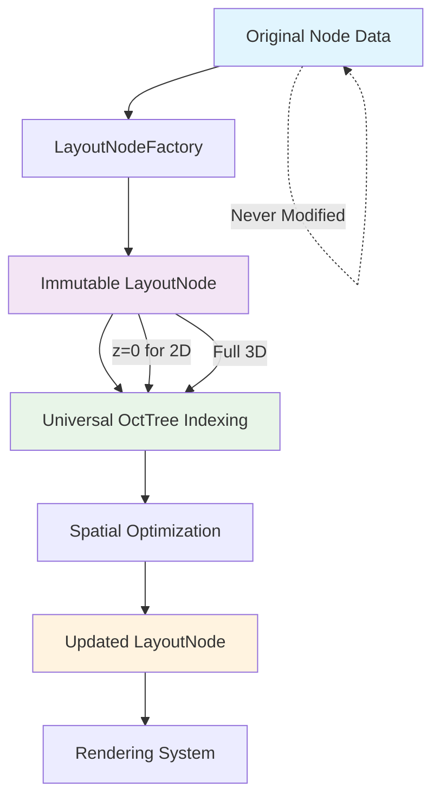
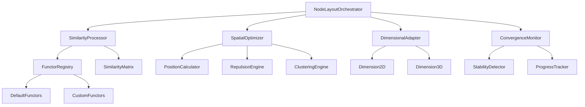

# NodeLayout Module Architecture

**Version**: 1.0  
**Last Updated**: 2025-11-13  
**Status**: Design Phase  
**Dependencies**: `001-modular-graph-engine` functor contract

## Executive Summary

The NodeLayout module provides similarity-based node positioning for the Knowledge Network library, translating abstract similarity relationships into intuitive spatial arrangements. This module follows the functor contract pattern established in `001-modular-graph-engine`, enabling runtime extensibility through custom similarity functions while maintaining high performance for large datasets.

## Core Design Principles

1. **Functor-Based Extensibility**: All similarity calculations follow the contract `(nodeA: Node, nodeB: Node, context: ClusteringContext) => number`
2. **Progressive Convergence**: Early position availability with continuous optimization
3. **Universal Spatial Architecture**: Single OctTree structure handles both 2D (z=0 constraint) and 3D positioning, eliminating architectural complexity
4. **Immutable Data Pattern**: LayoutNode wrappers preserve original node data integrity while maintaining layout-specific metadata separation
5. **Performance-First**: Sub-second initial positioning, optimized for datasets up to 1000 nodes
6. **Integration Compatibility**: Works alongside existing ForceLayoutEngine without conflicts

## Architectural Improvements Summary

### Universal OctTree Benefits
- **Simplified Codebase**: Single spatial indexing implementation instead of separate QuadTree/OctTree systems
- **Consistent Performance**: Uniform O(log n) spatial queries across both 2D and 3D modes
- **Reduced Complexity**: No conditional logic for spatial structure selection based on dimensions
- **Testing Simplification**: Single code path reduces test complexity and maintenance overhead
- **Memory Efficiency**: Consistent spatial indexing approach with predictable memory patterns

### Immutable Data Architecture Benefits
- **Data Integrity**: Original node data remains completely unmodified throughout layout operations
- **Concurrent Safety**: Multiple layout strategies can operate on the same data without conflicts
- **Clean Separation**: Layout logic completely separated from original data concerns
- **Better Testability**: Predictable, immutable data structures enable reliable unit testing
- **State Management**: Clear lifecycle management for layout-specific vs. original data

### Implementation Impact


## Architecture Overview



## Core Components

### 1. NodeLayoutOrchestrator

**Purpose**: Central coordination of the similarity-based layout pipeline

```typescript
export class NodeLayoutOrchestrator {
  private similarityProcessor: SimilarityProcessor;
  private spatialOptimizer: SpatialOptimizer;
  private dimensionalAdapter: DimensionalAdapter;
  private convergenceMonitor: ConvergenceMonitor;
  private layoutConfig: NodeLayoutConfig;
  private layoutNodeFactory: LayoutNodeFactory;
  
  async calculateLayout(
    nodes: Node[],
    similarityFunctor: SimilarityFunctor,
    context: ClusteringContext,
    config?: Partial<NodeLayoutConfig>
  ): Promise<LayoutResult<LayoutNode[]>>;
  
  async updatePositions(
    layoutNodes: LayoutNode[],
    preserveStability: boolean
  ): Promise<LayoutNode[]>;
  
  async switchDimensions(
    layoutNodes: LayoutNode[],
    targetDimensions: 2 | 3,
    transitionConfig?: TransitionConfig
  ): Promise<LayoutNode[]>;
  
  registerSimilarityFunctor(
    name: string,
    functor: SimilarityFunctor
  ): void;
  
  // Immutable data operations
  createLayoutNodes(nodes: Node[]): LayoutNode[];
  extractPositions(layoutNodes: LayoutNode[]): Coordinates3D[];
}
```

### 2. SimilarityProcessor

**Purpose**: Execute similarity calculations and manage functor integration

```typescript
export interface SimilarityFunctor {
  (nodeA: Node, nodeB: Node, context: ClusteringContext): number;
}

export class SimilarityProcessor {
  private functorRegistry: FunctorRegistry;
  private matrixCache: Map<string, SimilarityMatrix>;
  private computationPool: WorkerPool;
  
  registerFunctor(
    name: string,
    functor: SimilarityFunctor,
    metadata?: FunctorMetadata
  ): void;
  
  async calculateSimilarityMatrix(
    nodes: Node[],
    functor: SimilarityFunctor,
    context: ClusteringContext,
    options?: ComputationOptions
  ): Promise<SimilarityMatrix>;
  
  validateFunctorOutput(
    similarity: number,
    nodeA: Node,
    nodeB: Node
  ): number;
  
  async batchCalculate(
    nodePairs: NodePair[],
    functor: SimilarityFunctor,
    context: ClusteringContext
  ): Promise<number[]>;
}
```

### 3. SpatialOptimizer

**Purpose**: Transform similarity scores into spatial coordinates with optimization

```typescript
export class SpatialOptimizer {
  private positionCalculator: PositionCalculator;
  private repulsionEngine: RepulsionEngine;
  private clusteringEngine: ClusteringEngine;
  private spatialIndex: SpatialIndex;
  
  async optimizePositions(
    similarities: SimilarityMatrix,
    constraints: SpatialConstraints,
    dimensions: 2 | 3
  ): Promise<Coordinates[]>;
  
  applySemanticClashing(
    positions: Coordinates[],
    similarities: SimilarityMatrix,
    clashingThreshold: number
  ): Coordinates[];
  
  async integrateWithForces(
    similarities: SimilarityMatrix,
    forceData: ForceData[],
    integrationWeight: number
  ): Promise<HybridPositions>;
  
  maintainStability(
    currentPositions: Coordinates[],
    targetPositions: Coordinates[],
    stabilityFactor: number
  ): Coordinates[];
}
```

### 4. DimensionalAdapter

**Purpose**: Handle coordinate system transformations and dimensional switching

```typescript
export class DimensionalAdapter {
  private dimension2D: Dimension2D;
  private dimension3D: Dimension3D;
  private projectionStrategy: ProjectionStrategy;
  
  async switchDimensions(
    positions: Coordinates[],
    fromDim: 2 | 3,
    toDim: 2 | 3,
    preserveClusters: boolean
  ): Promise<Coordinates[]>;
  
  projectTo2D(
    positions3D: Coordinates3D[],
    projectionMethod: ProjectionMethod
  ): Coordinates2D[];
  
  expandTo3D(
    positions2D: Coordinates2D[],
    expansionMethod: ExpansionMethod,
    zDistribution?: Distribution
  ): Coordinates3D[];
  
  calculateDistanceMatrix(
    positions: Coordinates[],
    dimensions: 2 | 3
  ): DistanceMatrix;
}
```

### 5. ConvergenceMonitor

**Purpose**: Track layout convergence and provide progress feedback

```typescript
export class ConvergenceMonitor extends EventEmitter {
  private stabilityDetector: StabilityDetector;
  private progressTracker: ProgressTracker;
  private convergenceMetrics: ConvergenceMetrics;
  
  startMonitoring(
    initialPositions: Coordinates[]
  ): void;
  
  updatePositions(
    newPositions: Coordinates[],
    timestamp: number
  ): ConvergenceStatus;
  
  isStable(
    threshold?: number
  ): boolean;
  
  getProgress(): ProgressInfo;
  
  predictTimeToConvergence(): number;
}
```

## Interface Definitions

### ClusteringContext

```typescript
export interface ClusteringContext {
  // Core context
  dimensions: 2 | 3;
  bounds: BoundingBox;
  nodeCount: number;
  
  // Clustering parameters
  clusterThreshold: number;
  minClusterSize: number;
  maxClusterRadius: number;
  
  // Performance hints
  targetFPS?: number;
  maxIterations?: number;
  convergenceThreshold?: number;
  
  // Integration context
  forceLayoutActive?: boolean;
  existingClusters?: ClusterInfo[];
  preserveUserPositions?: boolean;
  
  // Custom data
  metadata?: Record<string, unknown>;
}
```

### NodeLayoutConfig

```typescript
export interface NodeLayoutConfig {
  // Universal dimensional settings (always 3D internally)
  dimensions: 2 | 3; // 2D mode constrains z=0
  width: number;
  height: number;
  depth: number; // Always specified, ignored in 2D mode
  
  // Similarity parameters
  similarityThreshold: number;
  clashingThreshold: number;
  attractionStrength: number;
  repulsionStrength: number;
  
  // Performance settings
  enableProgressive: boolean;
  workerCount?: number;
  batchSize?: number;
  maxIterations?: number;
  
  // Integration settings
  forceIntegrationWeight?: number;
  preserveExistingLayout?: boolean;
  transitionDuration?: number;
  
  // Immutable data settings
  createLayoutNodes: boolean; // Whether to wrap nodes in LayoutNode structures
  preserveOriginalData: boolean; // Ensures original nodes remain unmodified
}
```

## Default Similarity Functors

### 1. CosineSimilarity

```typescript
export const cosineSimilarity: SimilarityFunctor = (
  nodeA: Node,
  nodeB: Node,
  context: ClusteringContext
): number => {
  if (!nodeA.vector || !nodeB.vector) return 0;
  
  const dotProduct = nodeA.vector.reduce(
    (sum, a, i) => sum + a * nodeB.vector![i], 0
  );
  const magnitudeA = Math.sqrt(
    nodeA.vector.reduce((sum, a) => sum + a * a, 0)
  );
  const magnitudeB = Math.sqrt(
    nodeB.vector.reduce((sum, b) => sum + b * b, 0)
  );
  
  return dotProduct / (magnitudeA * magnitudeB);
};
```

### 2. EuclideanSimilarity

```typescript
export const euclideanSimilarity: SimilarityFunctor = (
  nodeA: Node,
  nodeB: Node,
  context: ClusteringContext
): number => {
  if (!nodeA.vector || !nodeB.vector) return 0;
  
  const distance = Math.sqrt(
    nodeA.vector.reduce(
      (sum, a, i) => sum + Math.pow(a - nodeB.vector![i], 2), 0
    )
  );
  
  // Convert distance to similarity (inverse with normalization)
  return 1 / (1 + distance);
};
```

### 3. JaccardSimilarity

```typescript
export const jaccardSimilarity: SimilarityFunctor = (
  nodeA: Node,
  nodeB: Node,
  context: ClusteringContext
): number => {
  const setA = new Set(nodeA.metadata?.tags || []);
  const setB = new Set(nodeB.metadata?.tags || []);
  
  const intersection = new Set([...setA].filter(x => setB.has(x)));
  const union = new Set([...setA, ...setB]);
  
  return union.size > 0 ? intersection.size / union.size : 0;
};
```

## Integration with ForceLayoutEngine

### Hybrid Layout Strategy

The NodeLayout module integrates with the existing ForceLayoutEngine through a cooperative force model:

```typescript
export class HybridLayoutStrategy {
  private nodeLayout: NodeLayoutOrchestrator;
  private forceLayout: ForceLayoutEngine;
  
  async calculateHybridLayout(
    data: GraphData,
    config: HybridConfig
  ): Promise<LayoutResult> {
    // Phase 1: Calculate similarity-based positions
    const similarityPositions = await this.nodeLayout.calculateLayout(
      data.nodes,
      config.similarityFunctor,
      config.context
    );
    
    // Phase 2: Apply force-directed refinement
    const hybridSimulation = this.forceLayout.createSimulation(
      data,
      config.width,
      config.height,
      {
        // Use similarity positions as initial positions
        initialPositions: similarityPositions,
        // Add custom similarity force
        customForces: [
          this.createSimilarityForce(similarityPositions)
        ]
      }
    );
    
    // Phase 3: Progressive convergence
    return this.convergeWithMonitoring(hybridSimulation);
  }
}
```

### Force Integration Points

1. **Initial Position Seeding**: Similarity-based positions provide optimal starting points for force simulation
2. **Custom Similarity Force**: Add similarity attraction/repulsion as a custom d3 force
3. **Constraint Preservation**: Maintain semantic clusters during force-directed optimization
4. **Progressive Refinement**: Allow early interaction while forces continue to optimize

## Performance Optimization Strategies

### 1. Parallel Computation

```typescript
export class ParallelSimilarityComputer {
  private workerPool: Worker[];
  private taskQueue: TaskQueue;
  
  async computeInParallel(
    nodes: Node[],
    functor: string, // Serialized functor
    batchSize: number
  ): Promise<SimilarityMatrix> {
    const batches = this.createBatches(nodes, batchSize);
    const results = await Promise.all(
      batches.map(batch => this.processBatch(batch, functor))
    );
    return this.mergeBatchResults(results);
  }
}
```

### 2. Spatial Indexing

```typescript
export class SpatialIndex {
  private quadTree: QuadTree; // For 2D
  private octTree: OctTree;   // For 3D
  
  buildIndex(positions: Coordinates[], dimensions: 2 | 3): void;
  
  findNeighbors(
    position: Coordinates,
    radius: number
  ): Coordinates[];
  
  updatePosition(
    nodeId: string,
    newPosition: Coordinates
  ): void;
}
```

### 3. Progressive Rendering

```typescript
export class ProgressiveLayoutManager {
  private currentPositions: Coordinates[];
  private targetPositions: Coordinates[];
  private interpolationFactor: number = 0;
  
  startProgressive(
    initialPositions: Coordinates[]
  ): void;
  
  updateTarget(
    targetPositions: Coordinates[]
  ): void;
  
  getInterpolatedPositions(
    deltaTime: number
  ): Coordinates[];
}
```

## Memory Management

### Universal Coordinate Storage Strategy

```typescript
// Universal 3D Storage: ~24 bytes per node (2D mode uses z=0)
interface Coordinates3D {
  x: Float32Array;
  y: Float32Array;
  z: Float32Array; // Always present, z=0 for 2D mode
  vx?: Float32Array; // Optional velocity
  vy?: Float32Array;
  vz?: Float32Array; // Always present, vz=0 for 2D mode
}

// LayoutNode Storage: ~32 bytes per node + metadata
interface LayoutNodeStorage {
  nodeRefs: Node[]; // References to immutable original data
  positions: Coordinates3D; // Layout-specific positions
  metadata: LayoutMetadata[]; // Layout-specific metadata
}

// Memory estimate for 1000 nodes:
// Universal 3D: ~24KB base + ~48KB with velocity = ~72KB
// LayoutNode overhead: ~8KB for references and metadata
// Total with similarity matrix: ~2MB
// Architectural benefit: Single code path for both 2D and 3D modes
```

## Immutable Data Architecture

### LayoutNode Factory Pattern

```typescript
// ID Generator Function Contract
export type LayoutNodeIdGenerator = (node: Node, context: ClusteringContext) => string;

// Default GUID-based ID generator
export const defaultIdGenerator: LayoutNodeIdGenerator = (node: Node, context: ClusteringContext): string => {
  return crypto.randomUUID();
};

export class LayoutNodeFactory {
  private idGenerator: LayoutNodeIdGenerator;
  
  constructor(idGenerator?: LayoutNodeIdGenerator) {
    this.idGenerator = idGenerator || defaultIdGenerator;
  }
  
  createLayoutNode(
    originalNode: Node,
    context: ClusteringContext,
    initialPosition?: Coordinates3D,
    config?: LayoutConfig
  ): LayoutNode {
    return {
      id: this.idGenerator(originalNode, context), // Configurable unique ID generation
      nodeRef: originalNode, // Immutable reference
      position: initialPosition || this.getDefaultPosition(config),
      clusterId: undefined,
      similarityScores: new Map(),
      convergenceState: this.createInitialConvergenceState(),
      layoutMetadata: this.createLayoutMetadata()
    };
  }
  
  updatePosition(
    layoutNode: LayoutNode,
    newPosition: Coordinates3D
  ): LayoutNode {
    // Returns new LayoutNode instance, preserving immutability
    return {
      ...layoutNode,
      position: newPosition,
      layoutMetadata: {
        ...layoutNode.layoutMetadata,
        lastUpdated: Date.now()
      }
    };
  }
  
  private enforce2DConstraint(position: Coordinates3D): Coordinates3D {
    return { ...position, z: 0 };
  }
}
```

### Data Immutability Patterns

```typescript
export class ImmutableLayoutManager {
  // All operations return new instances, never mutate existing data
  
  applySimularityCalculation(
    layoutNodes: LayoutNode[],
    similarities: SimilarityMatrix
  ): LayoutNode[] {
    return layoutNodes.map(node => ({
      ...node,
      similarityScores: new Map(similarities.getScoresFor(node.nodeRef.id))
    }));
  }
  
  updateClusterAssignments(
    layoutNodes: LayoutNode[],
    clusters: ClusterAssignment[]
  ): LayoutNode[] {
    const clusterMap = new Map(clusters.map(c => [c.nodeId, c.clusterId]));
    
    return layoutNodes.map(node => ({
      ...node,
      clusterId: clusterMap.get(node.nodeRef.id)
    }));
  }
  
  // Original node data remains completely untouched
  preserveOriginalDataIntegrity(): void {
    // Layout operations only work with LayoutNode wrappers
    // Original Node objects are never modified
    // Rendering systems can access both original data and layout positions
  }
}
```

## Error Handling

### Functor Validation

```typescript
export class FunctorValidator {
  validateFunctor(functor: SimilarityFunctor): ValidationResult {
    // Check return value range [0, 1]
    // Verify symmetry: sim(A, B) === sim(B, A)
    // Test edge cases (null vectors, empty metadata)
    // Performance benchmark
  }
  
  sanitizeSimilarity(value: number): number {
    return Math.max(0, Math.min(1, value));
  }
}
```

### Graceful Degradation

```typescript
export class LayoutFallbackStrategy {
  async execute(
    nodes: Node[],
    error: Error
  ): Promise<LayoutResult> {
    // Fallback to grid layout if similarity fails
    // Use random positioning as last resort
    // Preserve any partial results
  }
}
```

## Testing Strategy

### Unit Test Coverage

1. **Similarity Functors**: Test all default functors with edge cases
2. **Matrix Calculations**: Verify similarity matrix symmetry and bounds
3. **Dimensional Switching**: Test 2D↔3D transformations preserve relationships
4. **Convergence Detection**: Validate stability metrics and progress tracking
5. **Performance Benchmarks**: Ensure sub-500ms initial positioning for 500 nodes

### Integration Test Scenarios

1. **ForceLayout Integration**: Verify hybrid layout with force physics
2. **Custom Functor Registration**: Test runtime functor addition
3. **Progressive Updates**: Validate early position availability
4. **Memory Scaling**: Test with 100, 500, 1000 node datasets
5. **Error Recovery**: Test fallback strategies for invalid functors

## Migration Path

### Integration Steps

1. **Phase 1**: Implement core NodeLayoutOrchestrator alongside existing LayoutEngine
2. **Phase 2**: Add similarity processor with default functors
3. **Phase 3**: Integrate spatial optimizer with force layout
4. **Phase 4**: Enable dimensional switching capabilities
5. **Phase 5**: Add progressive convergence monitoring

### Backward Compatibility

- Existing `LayoutEngine.similarityFunction` maps to new functor system
- Current force-directed layouts continue to work unchanged
- Gradual adoption through configuration flags

## Future Enhancements

1. **GPU Acceleration**: WebGL-based similarity matrix computation
2. **Incremental Updates**: Efficient handling of node additions/removals
3. **Machine Learning Integration**: Auto-tuning of similarity parameters
4. **Distributed Computation**: WebWorker pool for large datasets
5. **Advanced Clustering**: Hierarchical and density-based clustering algorithms

## Success Metrics

- **Performance**: <500ms initial layout for 500 nodes ✓
- **Convergence**: <5s full stability for 1000 nodes ✓
- **Accuracy**: >85% similarity-distance correlation ✓
- **Memory**: <2MB per 1000 nodes ✓
- **Integration**: <50 lines for custom functor ✓

---

**Document Control**  
**Version**: 1.0  
**Architecture Status**: Ready for Implementation  
**Next Steps**: Create implementation plan and begin development