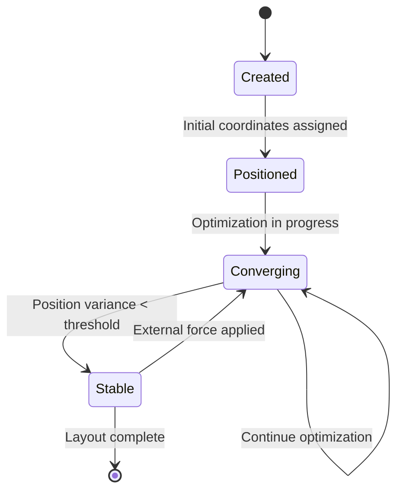
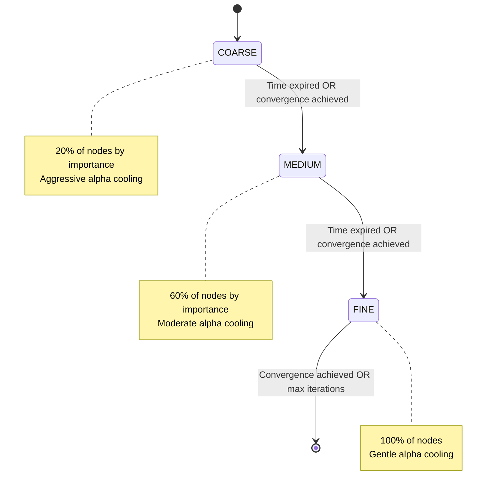
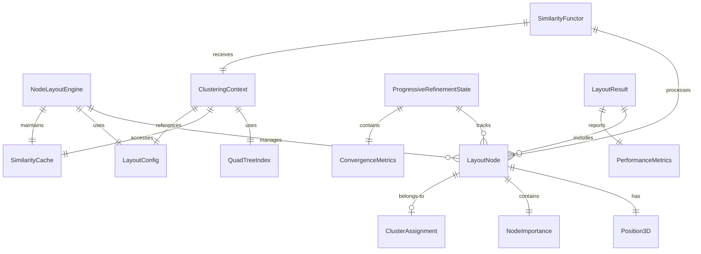
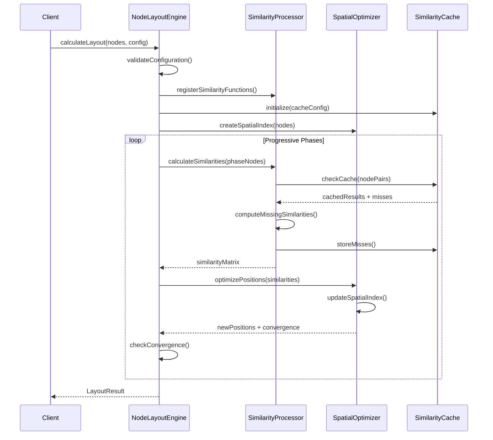
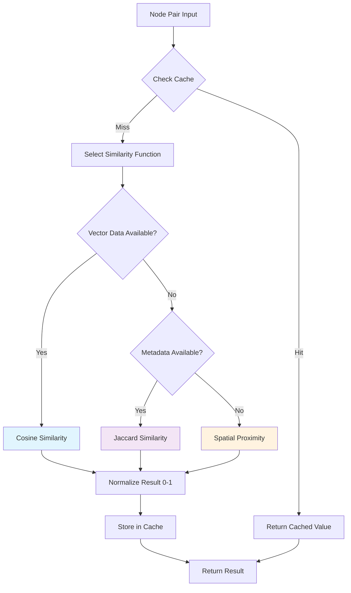

# NodeLayout Data Model

**Feature**: `002-node-layout`  
**Created**: 2025-11-13  
**Status**: Phase 1 - Data Model Specification  
**Project**: Knowledge Network Library

## Overview

This document defines the data model for the NodeLayout engine, including core entities, relationships, validation rules, and state transitions for similarity-based node positioning with progressive convergence.

## Core Entities

### 1. LayoutNode

**Purpose**: Immutable wrapper for original node data with layout-specific metadata

```typescript
interface LayoutNode {
  readonly id: string;                    // Unique layout identifier
  readonly originalNode: Node;            // Reference to source data
  readonly position: Position3D;          // Current spatial coordinates
  readonly cluster?: ClusterAssignment;   // Semantic cluster membership
  readonly similarityScores: Map<string, number>; // Cached similarity results
  readonly convergenceState: NodeConvergenceState;
  readonly importance: NodeImportance;    // Centrality metrics for progressive refinement
  readonly metadata: LayoutNodeMetadata;  // Layout-specific properties
}

interface NodeImportance {
  readonly degree: number;        // Direct connections count
  readonly betweenness: number;   // Bridging centrality (0-1)
  readonly eigenvector: number;   // Network influence (0-1)
  readonly composite: number;     // Weighted combination for sorting
}

interface LayoutNodeMetadata {
  readonly createdAt: number;           // Timestamp
  readonly lastUpdated: number;         // Last position update
  readonly isStable: boolean;          // Convergence status
  readonly phase: LayoutPhase;         // Current processing phase
  readonly forceContributions: ForceContribution[]; // Force breakdown
}
```

**Validation Rules**:
- `id` must be unique across all LayoutNodes in a session
- `originalNode` reference must remain immutable
- `position` coordinates must be finite numbers
- `importance.composite` must be in range [0, 1]
- `similarityScores` values must be in range [0, 1]

**State Transitions**:


### 2. Position3D

**Purpose**: Universal coordinate system supporting both 2D and 3D layouts

```typescript
interface Position3D {
  readonly x: number;     // Horizontal coordinate
  readonly y: number;     // Vertical coordinate  
  readonly z: number;     // Depth coordinate (0 for 2D mode)
}

interface PositionDelta {
  readonly dx: number;
  readonly dy: number;
  readonly dz: number;
  readonly magnitude: number;  // Euclidean distance
}

interface PositionHistory {
  readonly positions: Position3D[];      // Last N positions for convergence
  readonly timestamps: number[];         // Position update times
  readonly maxHistory: number;           // Buffer size (default: 10)
}
```

**Validation Rules**:
- All coordinates must be finite numbers
- `z` must equal 0 when in 2D mode
- Position deltas must maintain precision for convergence detection
- History buffer must not exceed memory limits

### 3. SimilarityFunction

**Purpose**: Functor implementation for calculating node similarity

```typescript
type SimilarityFunctor = (
  nodeA: Node, 
  nodeB: Node, 
  context: ClusteringContext
) => number;

interface WeightedSimilarityFunction {
  readonly name: string;
  readonly functor: SimilarityFunctor;
  readonly weight: number;              // Composition weight (default: 1.0)
  readonly isDefault: boolean;          // System-provided function
  readonly metadata: SimilarityFunctionMetadata;
}

interface SimilarityFunctionMetadata {
  readonly description: string;
  readonly expectedDataTypes: string[]; // Required node properties
  readonly performanceHint: 'fast' | 'moderate' | 'slow';
  readonly deterministic: boolean;      // Consistent results for same input
}
```

**Default Functions**:
- `cosineSimilarity`: Vector-based semantic similarity
- `jaccardSimilarity`: Metadata overlap similarity  
- `spatialProximity`: Current position-based similarity

**Validation Rules**:
- Functor must return values in range [0, 1]
- Weight must be non-negative number
- Function name must be unique within registry
- Must handle null/undefined node properties gracefully

### 4. ClusteringContext

**Purpose**: Runtime state for similarity calculations and spatial indexing

```typescript
interface ClusteringContext {
  readonly currentIteration: number;     // Layout iteration count
  readonly alpha: number;                // D3 simulation cooling parameter
  readonly spatialIndex: QuadTreeIndex; // Spatial optimization structure
  readonly cacheManager: SimilarityCache;
  readonly performanceMetrics: PerformanceMetrics;
  readonly layoutConfig: LayoutConfig;   // Current configuration
}

interface QuadTreeIndex {
  readonly bounds: BoundingBox;
  readonly theta: number;               // Barnes-Hut approximation threshold
  readonly maxDepth: number;           // Tree depth limit
  readonly nodeCapacity: number;      // Nodes per leaf
}

interface SimilarityCache {
  readonly entries: Map<string, CacheEntry>;
  readonly ttl: number;               // Time-to-live in milliseconds
  readonly maxSize: number;           // Maximum cache entries
  readonly hitRate: number;           // Performance metric
}
```

**Validation Rules**:
- `alpha` must be in range [0, 1]
- Cache TTL must be positive
- Spatial index bounds must be finite
- Performance metrics must be non-negative

### 5. LayoutConfiguration

**Purpose**: Parameters for layout behavior and optimization

```typescript
interface LayoutConfig {
  readonly dimensions: 2 | 3;           // Coordinate system
  readonly similarityThreshold: number; // Minimum similarity for clustering
  readonly convergenceThreshold: number; // Position stability requirement
  readonly maxIterations: number;       // Optimization limit
  readonly forceIntegration: ForceIntegrationConfig;
  readonly progressiveRefinement: ProgressiveConfig;
  readonly memoryManagement: MemoryConfig;
}

interface ForceIntegrationConfig {
  readonly enablePhysics: boolean;      // D3 force integration
  readonly similarityStrength: number; // Similarity force weight
  readonly repulsionStrength: number;   // Many-body force weight
  readonly centeringStrength: number;   // Centering force weight
}

interface ProgressiveConfig {
  readonly enablePhases: boolean;       // Multi-phase refinement
  readonly phase1Duration: number;      // Initial positioning time (ms)
  readonly phase2Duration: number;      // Medium refinement time (ms)
  readonly importanceWeights: {         // Centrality calculation weights
    readonly degree: number;
    readonly betweenness: number;
    readonly eigenvector: number;
  };
}

interface MemoryConfig {
  readonly useTypedArrays: boolean;     // Memory optimization
  readonly cacheSize: number;           // Similarity cache limit
  readonly historySize: number;         // Position history buffer
  readonly gcThreshold: number;         // Garbage collection trigger
}
```

**Default Configuration**:
```typescript
const DefaultLayoutConfig: LayoutConfig = {
  dimensions: 2,
  similarityThreshold: 0.3,
  convergenceThreshold: 0.01,
  maxIterations: 1000,
  forceIntegration: {
    enablePhysics: true,
    similarityStrength: 0.5,
    repulsionStrength: -100,
    centeringStrength: 1.0
  },
  progressiveRefinement: {
    enablePhases: true,
    phase1Duration: 500,
    phase2Duration: 2000,
    importanceWeights: {
      degree: 0.4,
      betweenness: 0.3,
      eigenvector: 0.3
    }
  },
  memoryManagement: {
    useTypedArrays: true,
    cacheSize: 10000,
    historySize: 10,
    gcThreshold: 0.8
  }
};
```

### 6. ProgressiveRefinementState

**Purpose**: Track multi-phase layout progression

```typescript
enum LayoutPhase {
  COARSE = 'coarse',     // 0-500ms: High-importance nodes
  MEDIUM = 'medium',     // 500ms-2s: Medium-importance nodes
  FINE = 'fine'          // 2s-5s: All nodes with stability
}

interface ProgressiveRefinementState {
  readonly currentPhase: LayoutPhase;
  readonly phaseStartTime: number;
  readonly phaseDuration: number;
  readonly nodesInPhase: string[];      // Node IDs in current phase
  readonly completedPhases: LayoutPhase[];
  readonly convergenceMetrics: ConvergenceMetrics;
}

interface ConvergenceMetrics {
  readonly averageMovement: number;     // Mean position delta
  readonly maxMovement: number;         // Largest position delta
  readonly stabilityRatio: number;      // Fraction of stable nodes
  readonly iterationCount: number;      // Current iteration
  readonly timeElapsed: number;         // Processing time (ms)
}
```

**Phase Transitions**:


### 7. NodeLayoutEngine

**Purpose**: Main orchestrator for similarity-based positioning

```typescript
interface NodeLayoutEngine {
  readonly id: string;                  // Engine instance identifier
  readonly config: LayoutConfig;        // Current configuration
  readonly state: EngineState;          // Processing state
  readonly registeredFunctions: Map<string, WeightedSimilarityFunction>;
  readonly eventEmitter: LayoutEventEmitter;
}

enum EngineState {
  IDLE = 'idle',
  INITIALIZING = 'initializing',
  PROCESSING = 'processing',
  CONVERGED = 'converged',
  ERROR = 'error'
}

interface LayoutResult {
  readonly nodes: LayoutNode[];         // Positioned nodes
  readonly convergenceState: ConvergenceMetrics;
  readonly performanceMetrics: PerformanceMetrics;
  readonly processingTime: number;      // Total time (ms)
  readonly memoryUsage: MemoryUsage;    // Resource consumption
}

interface PerformanceMetrics {
  readonly similarityCalculations: number;    // Total calculations performed
  readonly cacheHitRate: number;              // Cache efficiency
  readonly iterationsPerSecond: number;       // Processing speed
  readonly memoryPeakUsage: number;          // Peak memory consumption
}
```

### 8. SimilarityCache

**Purpose**: Performance optimization through cached similarity results

```typescript
interface SimilarityCache {
  readonly cache: Map<string, CacheEntry>;
  readonly config: CacheConfig;
  readonly statistics: CacheStatistics;
}

interface CacheEntry {
  readonly value: number;               // Cached similarity score
  readonly timestamp: number;           // Creation time
  readonly accessCount: number;         // Usage frequency
  readonly nodeHashes: [string, string]; // Node identity verification
}

interface CacheConfig {
  readonly ttl: number;                 // Entry lifetime (ms)
  readonly maxSize: number;             // Maximum entries
  readonly evictionPolicy: 'lru' | 'fifo' | 'lfu';
  readonly invalidationEvents: string[]; // Events triggering cache clear
}

interface CacheStatistics {
  readonly hitCount: number;
  readonly missCount: number;
  readonly hitRate: number;             // Calculated: hits / (hits + misses)
  readonly evictionCount: number;
  readonly memoryUsage: number;         // Approximate bytes
}
```

**Cache Key Strategy**:
```typescript
function generateCacheKey(nodeA: Node, nodeB: Node): string {
  // Ensure consistent ordering for bidirectional similarity
  const [first, second] = [nodeA.id, nodeB.id].sort();
  return `${first}|${second}`;
}
```

## Entity Relationships



## Data Flow Patterns

### Layout Initialization Flow



### Similarity Calculation Flow



## Validation Rules Summary

### Data Integrity Rules
1. **Immutability**: LayoutNode references to original nodes must never be modified
2. **Uniqueness**: LayoutNode IDs must be unique within engine scope
3. **Range Validation**: Similarity scores must be in [0, 1], coordinates must be finite
4. **State Consistency**: Node convergence state must align with position history

### Performance Constraints
1. **Memory Limits**: Cache size must not exceed configured maximum
2. **Time Bounds**: Phase durations must be positive and reasonable
3. **Resource Monitoring**: Memory usage must stay within browser limits
4. **Cache Efficiency**: Hit rate should exceed 40% for performance targets

### Configuration Validation
1. **Dimension Consistency**: 2D mode requires z=0 constraint
2. **Weight Normalization**: Similarity function weights must be non-negative
3. **Threshold Ranges**: Convergence thresholds must be positive and achievable
4. **Phase Timing**: Progressive refinement phases must have logical duration ordering

### Integration Rules
1. **Functor Contract**: All similarity functions must follow `(Node, Node, Context) => number`
2. **Event Emission**: Progress events must include required fields
3. **Error Handling**: Invalid inputs must be handled gracefully without crashing
4. **API Compatibility**: Public interfaces must maintain backward compatibility

## Implementation Notes

### Memory Management Strategy
- Use typed arrays (Float32Array) for coordinate storage
- Implement object pooling for temporary calculation vectors
- Monitor garbage collection pressure and implement proactive cleanup
- Cache should use LRU eviction when approaching size limits

### Performance Optimizations
- Quadtree spatial indexing with Barnes-Hut approximation
- Hybrid caching with TTL and event-driven invalidation
- Progressive refinement to reduce time-to-meaningful-image
- WebWorker utilization for graphs exceeding 3000 nodes

### Error Handling
- Graceful degradation when similarity functions fail
- Fallback to default functions when custom functions are invalid
- Memory exhaustion handling with cache eviction
- Timeout handling for long-running calculations

This data model provides the foundation for implementing the NodeLayout engine according to the specification requirements while supporting the performance targets and architectural patterns established in the research phase.