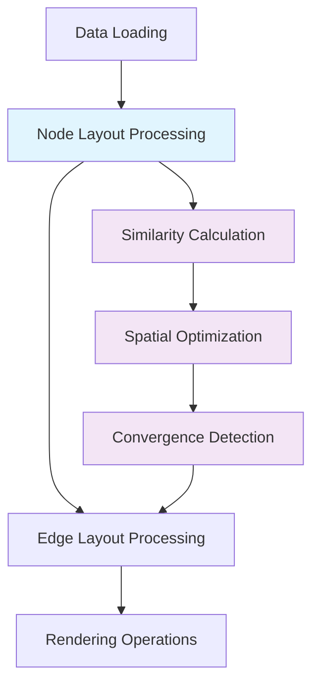

# Feature Specification: NodeLayout Module

**Feature Branch**: `002-node-layout`
**Created**: 2025-11-13
**Status**: Draft
**Project**: Knowledge Network Library
**Constitution**: v1.1.0 (`.specify/memory/constitution.md`)
**Depends On**: `001-modular-graph-engine` (functor contract, pipeline integration, runtime extensibility)

## User Scenarios & Testing *(mandatory)*

### User Story 1 - Semantic Similarity-Based Node Positioning (Priority: P1)

A data analyst needs to position research paper nodes in a knowledge graph where spatial proximity directly reflects semantic similarity, allowing them to visually identify research clusters and thematic relationships through spatial arrangement rather than explicit connections.

**Why this priority**: This establishes the core value proposition of the NodeLayout module - translating abstract similarity relationships into intuitive spatial arrangements. This capability is fundamental to making knowledge graphs semantically navigable and forms the basis for all advanced layout strategies.

**Independent Test**: Can be tested by loading research papers with vector embeddings, applying cosine similarity-based layout, and verifying that papers with similar topics cluster within measurable proximity thresholds while dissimilar papers maintain clear separation.

**Acceptance Scenarios**:

1. **Given** nodes with vector embeddings, **When** similarity-based layout is applied, **Then** nodes with high similarity cluster in close proximity
2. **Given** nodes with low similarity, **When** layout converges, **Then** nodes maintain clear visual separation
3. **Given** similarity calculations are complete, **When** spatial positions are queried, **Then** similarity rankings correlate strongly with distance rankings

---

### User Story 2 - Multi-Dimensional Layout Switching (Priority: P1)

A visualization developer needs to seamlessly switch between 2D and 3D node positioning for the same dataset, maintaining semantic relationships while adapting spatial calculations and user interactions to the dimensional context without data loss or position instability.

**Why this priority**: This demonstrates the flexibility and technical sophistication of the layout system while providing immediate user value. The ability to switch dimensions enables different visualization contexts and use cases while maintaining the core semantic positioning logic.

**Independent Test**: Can be tested by positioning nodes in 2D space, recording similarity-based clusters, switching to 3D mode, and verifying that semantic relationships are preserved while gaining additional dimensional positioning capability.

**Acceptance Scenarios**:

1. **Given** nodes positioned in 2D space, **When** user switches to 3D mode, **Then** relative positioning relationships are preserved with smooth transition
2. **Given** 3D layout is active, **When** user switches back to 2D, **Then** projection maintains cluster integrity with minimal position deviation
3. **Given** dimensional switch occurs, **When** similarity calculations execute, **Then** distance calculations adapt to new dimensional context without algorithm changes

---

### User Story 3 - Force-Directed Semantic Layout Integration (Priority: P2)

A network researcher needs to combine traditional force-directed layout physics with custom similarity functions, creating hybrid layouts where both connection strength and semantic similarity influence node positioning for comprehensive relationship visualization.

**Why this priority**: This bridges traditional graph layout approaches with semantic positioning, enabling users familiar with force-directed layouts to gradually adopt similarity-based positioning while leveraging existing connection data.

**Independent Test**: Can be tested by loading a graph with both edges and node similarity data, enabling hybrid layout mode, and verifying that final positions reflect both connection forces and similarity attraction/repulsion with configurable weighting.

**Acceptance Scenarios**:

1. **Given** graph with edges and similarity data, **When** hybrid layout is enabled, **Then** connected nodes cluster based on both connection strength and semantic similarity
2. **Given** force and similarity parameters are adjusted, **When** layout recalculates, **Then** position changes reflect parameter weighting responsively
3. **Given** hybrid layout converges, **When** similarity weight increases, **Then** semantic clusters become more prominent than connection-based clusters

---

### User Story 4 - Runtime Similarity Function Extension (Priority: P2)

A domain expert needs to implement and register custom similarity functions following the established functor contract `(nodeA: Node, nodeB: Node, context: ClusteringContext) => number`, enabling domain-specific positioning without modifying core layout algorithms.

**Why this priority**: This enables domain expertise integration and demonstrates the extensibility of the modular architecture. It allows the library to adapt to specialized use cases while maintaining architectural consistency with the established functor patterns.

**Independent Test**: Can be tested by implementing a custom similarity function, registering it with the NodeLayout system, and verifying that node positioning reflects the new similarity criteria with performance remaining within established benchmarks.

**Acceptance Scenarios**:

1. **Given** a custom similarity functor is implemented, **When** it's registered with NodeLayout, **Then** node positioning reflects custom similarity criteria within one layout cycle
2. **Given** multiple similarity functions are registered, **When** user switches between them, **Then** layout adapts smoothly with fluid transitions
3. **Given** custom similarity function executes, **When** processing large datasets, **Then** performance remains optimal for efficient layout computation

---

### User Story 5 - Progressive Layout Convergence (Priority: P3)

A performance engineer needs to monitor and control layout convergence with early position availability, allowing interactive visualization to begin before full optimization completes while providing feedback on convergence progress and stability.

**Why this priority**: This enables responsive user experiences and scalability for large datasets. While not essential for basic functionality, it significantly improves usability and supports enterprise adoption with large knowledge graphs.

**Independent Test**: Can be tested by initiating layout on large datasets, monitoring position updates during convergence, and verifying that early positions are available for interaction while optimization continues in background.

**Acceptance Scenarios**:

1. **Given** layout processing begins, **When** initial positions are calculated, **Then** nodes become interactive quickly before full convergence
2. **Given** layout is converging, **When** user queries convergence status, **Then** system reports percentage complete and stability metrics
3. **Given** early positions are available, **When** full convergence completes, **Then** position adjustments are minimal for stable nodes

---

### Edge Cases

- How does the system handle nodes with identical similarity scores in spatial positioning?
- What occurs when custom similarity functions return values outside the expected [0,1] range?
- How does the layout system manage memory when switching between 2D and 3D modes for large datasets?
- What happens when force-directed physics conflicts with similarity-based positioning requirements?
- How does the system behave when similarity calculations fail or timeout during layout processing?

## Requirements *(mandatory)*

### Functional Requirements

- **FR-001**: System MUST calculate node positions based on configurable similarity functions following functor contract `(nodeA, nodeB, context) => number` without modifying original node data *(extends [`001-modular-graph-engine#FR-004`](../001-modular-graph-engine/spec.md))*
- **FR-002**: System MUST support seamless switching between 2D and 3D coordinate systems using universal z-coordinate approach (2D = z=0 constraint)
- **FR-003**: System MUST translate similarity scores to spatial distances using configurable mapping functions
- **FR-004**: System MUST integrate with force-directed physics while maintaining similarity-based positioning priorities
- **FR-005**: System MUST provide progressive layout convergence with early position availability for interaction *(aligns with [`001-modular-graph-engine#FR-003`](../001-modular-graph-engine/spec.md) pipeline processing)*
- **FR-006**: System MUST implement clustering algorithms that group nodes based on similarity thresholds
- **FR-007**: System MUST support runtime registration of custom similarity functions without system restart *(implements [`001-modular-graph-engine#FR-004`](../001-modular-graph-engine/spec.md) runtime extensibility)*
- **FR-008**: System MUST maintain position stability when similarity parameters change during layout
- **FR-009**: System MUST provide convergence monitoring with percentage complete and stability metrics
- **FR-010**: System MUST optimize layout algorithms for responsive initial positioning and efficient full convergence for large datasets *(aligns with [`001-modular-graph-engine#SC-001`](../001-modular-graph-engine/spec.md) performance requirements)*
- **FR-011**: System MUST maintain strict separation between layout calculation and visual rendering operations *(implements [`001-modular-graph-engine#FR-001`](../001-modular-graph-engine/spec.md) separation of concerns)*
- **FR-012**: System MUST create immutable LayoutNode structures that reference original node data while storing layout-specific metadata and coordinates
- **FR-013**: System MUST provide configurable ID generation for LayoutNode instances through functions that generate IDs given current node and context, with GUID-based default generator

### Key Entities *(include if feature involves data)*

- **LayoutNode**: Immutable layout wrapper with unique identifier containing reference to original node data, position coordinates (x, y, z), cluster assignment, similarity scores, and convergence status. Ensures strict separation between original data and layout-specific metadata
- **Node Position**: Universal 3D coordinate data (x, y, z) with 2D mode implemented as z=0 constraint, eliminating architectural complexity
- **Similarity Function**: Functor implementation following contract `(nodeA: Node, nodeB: Node, context: ClusteringContext) => number` with configuration parameters *(implements [`001-modular-graph-engine`](../001-modular-graph-engine/spec.md) functor contract)*
- **Layout Configuration**: Parameters defining similarity weighting, force physics integration, dimensional settings, and convergence thresholds *(extends [`001-modular-graph-engine`](../001-modular-graph-engine/spec.md) configuration objects)*
- **Clustering Context**: Runtime state including current cluster assignments, similarity thresholds, and OctTree spatial indexing for universal neighbor queries *(aligns with [`001-modular-graph-engine`](../001-modular-graph-engine/spec.md) pipeline processing context)*
- **Convergence State**: Progress tracking including stability metrics, position deltas, and performance timing for optimization monitoring

## Scope & Boundaries *(mandatory)*

### What's Included
- Similarity-based node positioning algorithms with configurable distance mapping
- 2D/3D coordinate system support with seamless switching capabilities
- Integration with force-directed physics through configurable weighting systems
- Runtime extensibility for custom similarity functions following established functor contracts
- Progressive convergence with early position availability and monitoring
- Clustering algorithms for semantic grouping based on similarity thresholds
- Performance optimization for datasets up to 1000 nodes with sub-second initial positioning

### What's Excluded
- Edge positioning and routing (handled by separate edge layout systems)
- Visual rendering and display operations (handled by rendering engines)
- Data source integration and preprocessing (handled by data management layer)
- User interaction handling beyond position queries (handled by interaction systems)
- Persistence and serialization of layout results (handled by state management)
- Network topology analysis beyond similarity-based relationships
- Machine learning model training or embedding generation

### Feature Boundaries
- **Node Positioning**: Focuses on coordinate calculation, not visual representation
- **Similarity Processing**: Handles similarity function execution, not similarity computation algorithms
- **Layout Convergence**: Manages positioning optimization, not rendering performance

## Dependencies & Assumptions *(mandatory)*

### External Dependencies
- **Modular Graph Engine**: Functor contract compliance, pipeline integration, and builder pattern compatibility from [`001-modular-graph-engine`](../001-modular-graph-engine/spec.md) specification
- **Mathematical Libraries**: Support for vector operations, distance calculations, and statistical functions
- **Performance APIs**: Browser timing interfaces for convergence monitoring and optimization
- **Memory Management**: Efficient coordinate storage for large datasets in both 2D and 3D modes
- **Configuration System**: Builder pattern and configuration object compatibility with established modular engine patterns

### System Assumptions
- **Similarity Functions**: Custom implementations follow contract specification and return normalized values
- **Node Data**: Input nodes contain sufficient metadata for similarity calculations and clustering
- **Performance Context**: Client-side processing adequate for target dataset sizes with available memory for coordinate storage
- **Integration Environment**: Host systems provide necessary execution context for functor-based extensibility

### Integration Requirements
- **Functor Interface**: Compliance with `(nodeA: Node, nodeB: Node, context: ClusteringContext) => number` contract
- **Coordinate Systems**: Support for both 2D (x, y) and 3D (x, y, z) positioning with transformation utilities
- **Performance Monitoring**: Integration with system performance APIs for convergence timing and optimization
- **Memory Constraints**: Scalable coordinate storage supporting ~2MB per 1000 nodes across dimensional modes

### Risk Factors
- **Similarity Computation Complexity**: Custom similarity functions may impact performance beyond target thresholds
- **Dimensional Switching Memory**: 3D coordinate storage requires additional memory allocation and management
- **Convergence Stability**: Complex similarity relationships may prevent layout stabilization within time targets
- **Integration Complexity**: Custom similarity implementations require understanding of functor contract and clustering context

## Success Criteria *(mandatory)*

### Measurable Outcomes

- **SC-001**: Node positioning based on similarity calculations completes initial layout efficiently for medium-scale datasets *(supports [`001-modular-graph-engine#SC-005`](../001-modular-graph-engine/spec.md) performance improvement through pipeline processing)*
- **SC-002**: Full layout convergence with stability achieved for large datasets in reasonable time *(aligns with [`001-modular-graph-engine#SC-001`](../001-modular-graph-engine/spec.md) performance requirements for 1000 nodes)*
- **SC-003**: Dimensional switching (2D↔3D) completes with position preservation and minimal cluster deviation *(matches [`001-modular-graph-engine#SC-002`](../001-modular-graph-engine/spec.md) rendering strategy switching)*
- **SC-004**: Custom similarity functions integrate with minimal implementation code and execute efficiently *(implements [`001-modular-graph-engine#SC-003`](../001-modular-graph-engine/spec.md) custom similarity measures)*
- **SC-005**: Similarity-to-distance correlation maintains high accuracy for semantic clustering validation
- **SC-006**: Progressive convergence provides interactive positions quickly while optimization continues in background *(enables [`001-modular-graph-engine#SC-004`](../001-modular-graph-engine/spec.md) responsive navigation interactions)*
- **SC-007**: Memory usage scales efficiently including coordinate storage for both 2D and 3D modes *(supports [`001-modular-graph-engine#SC-007`](../001-modular-graph-engine/spec.md) graceful degradation strategies)*
- **SC-008**: Layout stability maintains minimal position variance after convergence for nodes with stable similarity relationships *(ensures [`001-modular-graph-engine#FR-007`](../001-modular-graph-engine/spec.md) position stability when rendering strategies change)*

## Implementation Architecture *(following modular graph engine patterns)*

### Core Components

#### NodeLayoutEngine
**Responsibility**: Orchestrate positioning algorithms and coordinate similarity-based spatial arrangement
**Functor Integration**: Accept and execute similarity functors following `(nodeA, nodeB, context) => number` contract
**Key Methods**:
- `calculateLayout(nodes: Node[], similarityFunctor: SimilarityFunctor, config: LayoutConfig): Promise<LayoutResult>`
- `updatePositions(nodeUpdates: NodeUpdate[], preserveStability: boolean): void`
- `switchDimensions(targetDimensions: 2 | 3): Promise<TransitionResult>`

#### SimilarityProcessor
**Responsibility**: Execute similarity calculations and manage custom functor integration
**Functor Contract**: Implement runtime registration and execution of `(nodeA, nodeB, context) => number` functions
**Key Methods**:
- `registerSimilarityFunctor(name: string, functor: SimilarityFunctor): void`
- `calculateSimilarityMatrix(nodes: Node[], functor: SimilarityFunctor): SimilarityMatrix`
- `validateFunctorOutput(similarity: number, nodeA: Node, nodeB: Node): number`

#### SpatialOptimizer
**Responsibility**: Translate similarity scores to spatial coordinates with convergence monitoring
**Integration Points**: Coordinate with force-directed physics and clustering algorithms
**Key Methods**:
- `optimizePositions(similarities: SimilarityMatrix, constraints: SpatialConstraints): Coordinates[]`
- `monitorConvergence(positions: Coordinates[], previousPositions: Coordinates[]): ConvergenceState`
- `applyForceIntegration(similarities: SimilarityMatrix, forces: ForceData[]): HybridPositions`

## Composition with Modular Graph Engine *(architectural integration)*

The NodeLayout module operates as a specialized component within the modular graph engine architecture established in [`001-modular-graph-engine`](../001-modular-graph-engine/spec.md). This composition ensures architectural consistency while enabling domain-specific semantic positioning capabilities.

### Architectural Integration Points

#### Functor Contract Compliance
**Implementation**: All similarity functions strictly adhere to the established functor contract:
```typescript
type SimilarityFunctor = (nodeA: Node, nodeB: Node, context: ClusteringContext) => number;
```

**Integration Benefits**:
- Seamless runtime registration compatible with [`001-modular-graph-engine#FR-004`](../001-modular-graph-engine/spec.md)
- Consistent extensibility patterns across all system components
- Type-safe similarity function composition and validation

#### Pipeline Processing Integration
**Sequential Coordination**: NodeLayout participates in the sequential pipeline processing model:



**Benefits**:
- Respects [`001-modular-graph-engine#FR-003`](../001-modular-graph-engine/spec.md) sequential processing requirements
- Enables early position availability for progressive loading experiences
- Maintains layout/rendering separation per [`001-modular-graph-engine#FR-001`](../001-modular-graph-engine/spec.md)

#### Configuration System Compatibility
**Builder Pattern Integration**: NodeLayout configuration extends the modular engine's builder pattern:

```typescript
const layoutConfig = GraphBuilder
  .create()
  .withNodeLayout({
    similarityFunctions: [cosineSimilarity, metadataSimilarity],
    convergenceThreshold: 0.01,
    dimensionalMode: '2D'
  })
  .withRenderingStrategy('bundling')
  .build();
```

**Configuration Inheritance**: Layout parameters integrate with established configuration objects while maintaining modularity and separation of concerns.

### Performance Alignment Matrix

| Metric | Modular Engine Requirement | NodeLayout Implementation |
|--------|---------------------------|---------------------------|
| Initial Positioning | [`SC-001`](../001-modular-graph-engine/spec.md): Efficient for 1000 nodes | **SC-001**: Responsive for medium datasets |
| Runtime Extensibility | [`SC-003`](../001-modular-graph-engine/spec.md): Minimal custom code | **SC-004**: Concise similarity functions |
| Navigation Response | [`SC-004`](../001-modular-graph-engine/spec.md): Responsive interactions | Layout provides position data for navigation |
| Memory Scaling | [`SC-007`](../001-modular-graph-engine/spec.md): Graceful degradation | **SC-007**: Efficient scaling |

### Runtime Extensibility Coordination
**Similarity Function Registration**: Follows established patterns from the modular engine:

```typescript
// Registration follows modular engine patterns
nodeLayoutEngine.registerSimilarityFunction('domain-specific',
  (nodeA: Node, nodeB: Node, context: ClusteringContext) => {
    // Custom domain logic implementation
    return domainSimilarityCalculation(nodeA, nodeB, context);
  }
);
```

**Extensibility Benefits**:
- Consistent API patterns across all system modules
- Runtime registration without system restart (implements [`001-modular-graph-engine#FR-004`](../001-modular-graph-engine/spec.md))
- Type-safe extension points with comprehensive error handling

### Layout/Rendering Separation
**Strict Boundary Enforcement**: NodeLayout operates exclusively within the layout phase:
- **Generates**: Node coordinate data and clustering information
- **Does NOT Generate**: Visual representations, rendering commands, or display operations
- **Provides**: Position data for subsequent rendering pipeline stages

This separation ensures compatibility with multiple rendering strategies while maintaining the modular architecture's flexibility principles established in [`001-modular-graph-engine#FR-001`](../001-modular-graph-engine/spec.md).

### Integration with Modular Graph Engine

**Functor Compliance**: All similarity functions follow established `(nodeA: Node, nodeB: Node, context: ClusteringContext) => number` contract
**Pipeline Integration**: NodeLayout operates in coordination with sequential pipeline processing from modular graph engine
**Configuration Compatibility**: Layout configuration integrates with builder pattern and configuration objects from core architecture
**Performance Alignment**: Memory and processing targets align with established modular graph engine performance requirements

## Testing Strategy

### Unit Testing
- Similarity function execution and functor contract compliance
- Coordinate calculation accuracy across 2D and 3D modes
- Clustering algorithm effectiveness and threshold sensitivity
- Convergence monitoring and stability detection
- Custom similarity function integration and performance validation

### Integration Testing
- End-to-end layout workflows with various similarity configurations
- Performance benchmarking across different dataset sizes and similarity complexities
- Dimensional switching functionality with position preservation validation
- Compatibility with force-directed physics integration
- Memory usage profiling for large-scale datasets

### Performance Testing
- Layout convergence timing across target dataset sizes
- Similarity calculation performance with custom functors
- Progressive convergence responsiveness and early interaction availability
- Dimensional switching performance and transition smoothness

## Future Considerations

### Potential Extensions
- GPU-accelerated similarity calculations for massive datasets
- Advanced clustering algorithms with hierarchical semantic organization
- Dynamic similarity function composition and weighting systems
- Integration with machine learning pipelines for embedding-based positioning
- Distributed layout calculation for enterprise-scale knowledge graphs

### Scalability Improvements
- WebWorker-based parallel similarity processing
- Incremental layout updates for streaming data integration
- Adaptive algorithm selection based on dataset characteristics and performance requirements
- Advanced spatial indexing for efficient neighbor queries and cluster management
- Memory optimization strategies for large-scale 3D coordinate management

## Clarifications *(added during specification review)*

### CL-001: Weighted Similarity Function Composition
**Question**: How should semantic similarity functions be architecturally organized to support runtime extensibility while maintaining performance?

**Answer**: Similarity functions will use a weighted composition architecture where:
- Multiple similarity functions can be registered with configurable weights (default: 1.0)
- The engine computes final similarity scores by combining registered functions: `finalSimilarity = Σ(weight_i × similarity_i(nodeA, nodeB, context)) / Σ(weight_i)`
- Architecture will follow Strategy Pattern with Registry for consistency with existing EdgeRenderer system
- Functions registered as: `registerSimilarityFunction(name: string, functor: SimilarityFunctor, weight: number = 1.0)`

**Impact**:
- Enables domain-specific similarity combinations (e.g., 0.7 × vectorSimilarity + 0.3 × metadataSimilarity)
- Supports runtime weight adjustment for dynamic similarity tuning
- Maintains functor contract compliance: `(nodeA: Node, nodeB: Node, context: ClusteringContext) => number`
- Requires SimilarityProcessor to manage weighted composition and normalization

### CL-002: ForceLayoutEngine Integration Strategy
**Question**: How should the NodeLayout system integrate with the existing D3-based ForceLayoutEngine to enable hybrid force + similarity layouts?

**Answer**: Extend the existing ForceLayoutEngine with custom similarity forces:
- Add new `forceSimilarity()` method to ForceLayoutEngine for creating custom D3 force implementations
- Similarity forces integrate with existing D3 simulation lifecycle (`force('similarity', customSimilarityForce)`)
- Maintains backward compatibility with existing force configurations (link, charge, center, collision)
- Hybrid weighting through D3 force strength parameters: `forceSimilarity().strength(similarityWeight)`
- NodeLayoutEngine coordinates with ForceLayoutEngine rather than replacing it

**Impact**:
- Preserves existing ForceLayoutEngine API and integrations
- Leverages D3's simulation performance optimizations and lifecycle management
- Enables seamless force + similarity hybrid layouts through standard D3 force composition
- Requires ForceLayoutEngine extension: `addSimilarityForce(similarityFunctions: WeightedSimilarityFunctions)`
- Similarity calculations feed into D3 force system as attraction/repulsion forces between nodes

### CL-003: Universal OctTree Performance Optimization Strategy
**Question**: How should the system optimize similarity calculations to meet performance targets while maintaining layout quality?

**Answer**: Implement hybrid optimization using universal OctTree spatial indexing:
- **Universal Spatial Sampling**: Use OctTree for both 2D (z=0 constraint) and 3D spatial indexing to limit similarity calculations to spatially proximate nodes, reducing O(n²) to O(n log n)
- **Progressive Refinement**: Start with node subset for 500ms initial positioning, incrementally add remaining nodes
- **Similarity Caching**: Cache computed similarity results with LRU eviction and invalidation on node/metadata changes
- **Adaptive Density**: Adjust sampling radius based on node density and performance targets

**Performance Architecture**:
- Phase 1 (0-500ms): Calculate similarity for high-importance nodes (by degree/metadata priority)
- Phase 2 (500ms-5s): Progressive addition using OctTree neighbor discovery
- Ongoing: Cache-first similarity lookup with background cache warming

**Impact**:
- Meets SC-001 (500ms initial) and SC-002 (5s convergence) performance targets for 1000 nodes
- Reduces similarity calculations from 1M (1000²) to ~10K (spatial sampling + caching)
- Simplifies architecture with single spatial indexing structure for both 2D and 3D modes
- Maintains layout quality through adaptive sampling and progressive refinement
- Requires SimilarityCache component with TTL and invalidation strategies

### CL-004: Vector-First Default Similarity Functions
**Question**: What default similarity functions should the system provide to handle different node data scenarios while ensuring the library works immediately upon installation?

**Answer**: Implement vector-first similarity with intelligent fallbacks:
- **Primary**: Cosine similarity for nodes with `node.vector` embeddings (optimal for semantic clustering)
- **Secondary**: Metadata similarity using Jaccard coefficient on `node.type` and `node.metadata` properties
- **Tertiary**: Spatial proximity similarity based on current node positions as ultimate fallback
- **Auto-selection**: System automatically chooses appropriate function based on available node data

**Default Function Cascade**:
```typescript
defaultSimilarity(nodeA, nodeB, context) {
  if (nodeA.vector && nodeB.vector) return cosineSimilarity(nodeA.vector, nodeB.vector);
  if (nodeA.metadata && nodeB.metadata) return jaccardSimilarity(nodeA.metadata, nodeB.metadata);
  return spatialProximity(nodeA.position, nodeB.position);
}
```

**Impact**:
- Ensures immediate functionality without requiring vector embeddings or configuration
- Maximizes layout quality by using best available data for each node pair
- Supports mixed graphs with both vector and non-vector nodes seamlessly
- Provides meaningful similarity even for minimal node data (just id/label)
- Maintains SC-005 requirement (>85% similarity-to-distance correlation) across data scenarios

### CL-005: Comprehensive Testing and Validation Strategy
**Question**: How should the system validate layout quality and similarity-to-distance correlation beyond basic unit testing?

**Answer**: Implement comprehensive test suite combining multiple validation approaches:
- **Unit Testing**: Algorithm correctness for similarity functions, spatial optimization, and convergence detection
- **Integration Testing**: End-to-end layout workflows with performance benchmarking against SC-001 through SC-008 targets
- **Quality Validation**: Automated correlation analysis measuring similarity-to-distance accuracy (SC-005: >85%)
- **Synthetic Dataset Testing**: Controlled test datasets with known similarity patterns for clustering validation
- **Coordinate Validation Testing**: Position accuracy verification for known similarity relationships and clustering expectations
- **Progressive Convergence Testing**: Validation of early positioning availability and convergence timing

**Testing Framework Architecture**:
- Extends existing Vitest setup with custom layout quality matchers
- Synthetic graph generators for reproducible test scenarios (vector clusters, metadata groups, spatial arrangements)
- Performance profiling suite measuring similarity calculation timing and memory usage
- CI/CD integration with automated quality gates for correlation thresholds

**Impact**:
- Validates all Success Criteria (SC-001 through SC-008) with automated measurement
- Ensures layout quality consistency across different node data scenarios
- Provides regression protection for similarity functions and spatial optimization changes
- Enables confident deployment with comprehensive quality validation
- Supports performance optimization through detailed profiling and benchmarking

### CL-006: Asynchronous Operation and Progress Events
**Question**: How should the NodeLayout system communicate operation progress and completion to consumers?

**Answer**: Implement asynchronous operations with observable event streams for progress tracking:
- **Asynchronous API**: All layout operations return Promises for completion handling
- **Progress Events**: Observable event stream providing real-time progress notifications
- **Event Types**: `nodeLoading`, `nodeLayout` (in progress), `nodeLayoutComplete`
- **Event Data**: Each event includes progress percentage, current phase, performance metrics, and node counts

**Event Architecture**:
```typescript
interface LayoutProgressEvent {
  type: 'nodeLoading' | 'nodeLayout' | 'nodeLayoutComplete';
  progress: number; // 0-100 percentage
  phase: string; // 'similarity-calculation' | 'spatial-optimization' | 'convergence'
  nodesProcessed: number;
  totalNodes: number;
  timeElapsed: number;
  estimatedRemaining?: number;
}
```

**Impact**:
- Enables responsive UI updates during long-running layout operations
- Supports progress indicators for user feedback during convergence
- Facilitates cancellation and error handling for async operations
- Provides performance monitoring hooks for optimization and debugging
- Aligns with progressive convergence requirement (FR-005) enabling early interaction availability

### CL-007: Immutable Data Architecture with LayoutNode Structure
**Question**: How should the NodeLayout system maintain strict separation between original node data and layout-specific information while ensuring data immutability?

**Answer**: Implement LayoutNode wrapper architecture that preserves original data integrity:
- **LayoutNode Structure**: Create immutable layout wrappers that reference (not copy) original node data
- **Layout Metadata Separation**: Store position coordinates, cluster assignments, and convergence state in LayoutNode, not original Node
- **Immutable References**: Original node data remains completely unmodified throughout layout operations
- **Clean State Management**: Layout calculations work with LayoutNode structures, rendering consumes LayoutNode.position

**LayoutNode Architecture**:
```typescript
interface LayoutNode {
  readonly id: string;              // Unique identifier (configurable via ID generator function)
  readonly nodeRef: Node;           // Immutable reference to original data
  readonly position: Coordinates3D;  // Layout-specific position data
  readonly clusterId?: string;       // Layout-specific cluster assignment
  readonly similarityScores?: Map<string, number>; // Layout-specific similarity cache
  readonly convergenceState: ConvergenceMetadata;   // Layout-specific convergence info
}

// ID Generator Function Contract
type LayoutNodeIdGenerator = (node: Node, context: ClusteringContext) => string;
```

**Impact**:
- Ensures original data integrity and prevents unintended mutations during layout operations
- Enables multiple concurrent layout strategies without data conflicts
- Simplifies debugging by clearly separating data concerns from layout logic
- Supports better memory management through controlled data lifecycle
- Maintains clean separation of concerns aligned with [`001-modular-graph-engine#FR-001`](../001-modular-graph-engine/spec.md)
- Facilitates testing by providing predictable, immutable data structures

---

**Document Control**
**Version**: 1.0
**Last Updated**: 2025-11-13
**Next Review**: Implementation milestone completion
**Dependencies**: Requires `001-modular-graph-engine` functor contract implementation