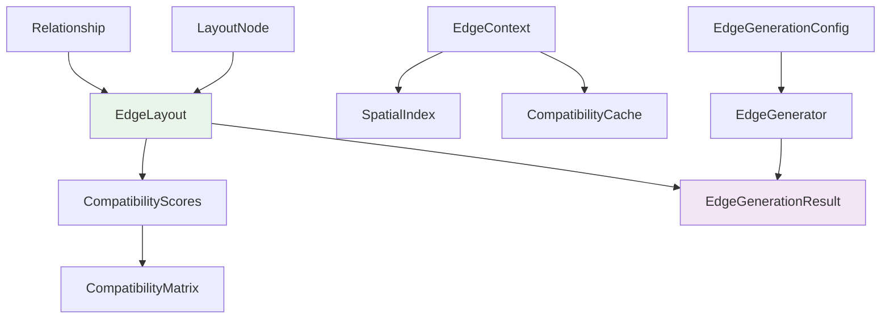

# Data Model: EdgeGenerator Module

**Date**: 2025-11-13  
**Feature**: EdgeGenerator Module  
**Branch**: `003-edge-generator`

## Overview

The EdgeGenerator module transforms relationship data into spatial edge structures with compatibility calculation support. This data model defines the core entities that enable async/Promise-based edge generation with runtime extensibility through functor patterns.

## Core Entities

### EdgeLayout

**Description**: Immutable edge structure that wraps relationship data while maintaining strict separation between original relationship information and generation-specific metadata.

**Usage**: Primary output of edge generation process, consumed by edge bundling and rendering systems.

```typescript
interface EdgeLayout {
  readonly id: string;                        // Unique edge identifier
  readonly relationship: Relationship;        // Immutable reference to original data
  readonly sourceNode: LayoutNode;           // Reference to source LayoutNode
  readonly targetNode: LayoutNode;           // Reference to target LayoutNode
  readonly compatibility: CompatibilityScores; // Compatibility with other edges
  readonly metadata: EdgeGenerationMetadata; // Generation-specific information
  readonly geometry: EdgeGeometry;           // Spatial properties for rendering
}

interface EdgeGenerationMetadata {
  readonly generatedAt: number;              // Timestamp
  readonly processingTime: number;           // Generation time in milliseconds
  readonly chunkId: string;                  // Batch processing identifier
  readonly compatibilityVersion: string;    // Functor version used
  readonly spatialIndex?: SpatialIndexEntry; // Spatial optimization data
}

interface EdgeGeometry {
  readonly startPoint: Point2D;              // Source node position
  readonly endPoint: Point2D;                // Target node position
  readonly controlPoints?: Point2D[];        // Bezier curve control points
  readonly length: number;                   // Euclidean distance
  readonly angle: number;                    // Edge angle in radians
}

interface Point2D {
  readonly x: number;
  readonly y: number;
}
```

**Validation Rules**:
- `id` must be unique across all edges in the graph
- `relationship.sourceId` must map to `sourceNode.id`
- `relationship.targetId` must map to `targetNode.id`
- `compatibility` scores must be normalized to [0,1] range
- `geometry.length` must be calculated from node positions

### Relationship

**Description**: Original relationship data from knowledge graph sources, preserved immutably throughout edge generation.

**Usage**: Input to edge generation process, referenced by EdgeLayout for data integrity.

```typescript
interface Relationship {
  readonly id: string;                       // Original relationship identifier
  readonly sourceId: string;                 // Source entity identifier
  readonly targetId: string;                 // Target entity identifier
  readonly type: string;                     // Relationship type/category
  readonly properties: RelationshipProperties; // Domain-specific metadata
  readonly weight?: number;                  // Relationship strength (0-1)
  readonly bidirectional?: boolean;          // Direction constraint
  readonly metadata?: Record<string, unknown>; // Extended properties
}

interface RelationshipProperties {
  readonly label?: string;                   // Human-readable label
  readonly description?: string;             // Relationship description
  readonly category?: string;                // Categorization
  readonly confidence?: number;              // Reliability score (0-1)
  readonly temporal?: TemporalProperties;    // Time-based constraints
  readonly semantic?: SemanticProperties;    // Semantic annotations
}

interface TemporalProperties {
  readonly createdAt?: number;               // Creation timestamp
  readonly updatedAt?: number;               // Last modification
  readonly validFrom?: number;               // Validity start time
  readonly validTo?: number;                 // Validity end time
}

interface SemanticProperties {
  readonly ontologyClass?: string;           // Ontology classification
  readonly semanticRole?: string;            // Semantic relationship role
  readonly contexts?: string[];              // Applicable contexts
}
```

**Validation Rules**:
- `sourceId` and `targetId` must reference existing entities
- `type` must be non-empty string
- `weight` if provided must be in [0,1] range
- `properties.confidence` if provided must be in [0,1] range

### EdgeContext

**Description**: Runtime context for compatibility calculations, spatial indexing, and performance optimization.

**Usage**: Passed to CompatibilityFunctor functions, provides access to graph state and optimization data.

```typescript
interface EdgeContext {
  readonly graphId: string;                  // Graph instance identifier
  readonly totalEdges: number;               // Total edge count for scaling
  readonly spatialIndex: SpatialIndex;       // Spatial optimization structure
  readonly compatibilityCache: CompatibilityCache; // Memoization cache
  readonly performanceMetrics: PerformanceMetrics; // Runtime performance data
  readonly configuration: EdgeGenerationConfig; // Current configuration
  readonly timestamp: number;                // Context creation time
}

interface SpatialIndex {
  readonly gridSize: number;                 // Spatial grid cell size
  readonly bounds: BoundingBox;              // Graph spatial bounds
  readonly edgeGrid: Map<string, EdgeLayout[]>; // Grid-based edge lookup
  
  getProximateEdges(edge: EdgeLayout, radius: number): EdgeLayout[];
  getGridKey(x: number, y: number): string;
  updateEdgePosition(edge: EdgeLayout): void;
}

interface BoundingBox {
  readonly minX: number;
  readonly maxX: number;
  readonly minY: number;
  readonly maxY: number;
  readonly width: number;
  readonly height: number;
}

interface CompatibilityCache {
  readonly maxSize: number;                  // Cache size limit
  readonly ttl: number;                      // Time-to-live in milliseconds
  
  get(keyA: string, keyB: string): number | undefined;
  set(keyA: string, keyB: string, compatibility: number): void;
  clear(): void;
  getStats(): CacheStats;
}

interface CacheStats {
  readonly hits: number;
  readonly misses: number;
  readonly size: number;
  readonly hitRate: number;
}

interface PerformanceMetrics {
  readonly memoryUsage: number;              // Current memory usage (bytes)
  readonly processingTime: number;           // Cumulative processing time
  readonly compatibilityCalculations: number; // Total compatibility calculations
  readonly averageCompatibilityTime: number; // Average calculation time
  readonly batchProcessingTimes: number[];   // Historical batch times
}
```

**Validation Rules**:
- `spatialIndex.gridSize` must be positive
- `compatibilityCache.maxSize` must be positive
- `performanceMetrics` values must be non-negative

### CompatibilityScores

**Description**: Compatibility scores between an edge and other edges in the graph, used for bundling decisions.

**Usage**: Stored in EdgeLayout, queried by bundling algorithms for grouping decisions.

```typescript
interface CompatibilityScores {
  readonly [edgeId: string]: number;         // Edge ID -> compatibility score (0-1)
}

interface CompatibilityMatrix {
  readonly edges: Map<string, CompatibilityScores>; // All compatibility relationships
  readonly statistics: CompatibilityStatistics; // Matrix statistics
  readonly version: string;                  // Matrix version for cache invalidation
  
  getCompatibility(edgeA: string, edgeB: string): number;
  getTopCompatible(edgeId: string, count: number): CompatibleEdge[];
  getBundlingGroups(threshold: number): EdgeGroup[];
}

interface CompatibilityStatistics {
  readonly totalPairs: number;               // Total edge pairs
  readonly averageCompatibility: number;     // Mean compatibility score
  readonly standardDeviation: number;        // Compatibility score variance
  readonly dynamicThresholds: DynamicThresholds; // Calculated thresholds
}

interface DynamicThresholds {
  readonly strongBundling: number;           // High compatibility threshold
  readonly moderateBundling: number;         // Medium compatibility threshold
  readonly weakBundling: number;             // Low compatibility threshold
  readonly isolationThreshold: number;       // Below this = no bundling
}

interface CompatibleEdge {
  readonly edgeId: string;
  readonly compatibilityScore: number;
}

interface EdgeGroup {
  readonly id: string;
  readonly edges: string[];                  // Edge IDs in group
  readonly averageCompatibility: number;     // Group cohesion score
  readonly centroid: Point2D;               // Group spatial center
}
```

### EdgeGenerationConfig

**Description**: Configuration parameters for edge generation process, including async processing options and compatibility settings.

**Usage**: Input to edge generation pipeline, controls behavior and performance characteristics.

```typescript
interface EdgeGenerationConfig {
  readonly processingMode: ProcessingMode;   // Simple or complex generation
  readonly batchSize: BatchSizeConfig;       // Adaptive batching parameters
  readonly compatibility: CompatibilityConfig; // Compatibility calculation settings
  readonly performance: PerformanceConfig;   // Performance optimization settings
  readonly events: EventConfig;              // Progress event configuration
  readonly errorHandling: ErrorHandlingConfig; // Error management settings
}

enum ProcessingMode {
  SIMPLE = 'simple',                        // Source/target only, no compatibility
  COMPLEX = 'complex'                       // Full compatibility analysis
}

interface BatchSizeConfig {
  readonly initialSize: number;              // Starting batch size (default: 1000)
  readonly minSize: number;                  // Minimum batch size (default: 100)
  readonly maxSize: number;                  // Maximum batch size (default: 2000)
  readonly adaptiveScaling: boolean;         // Enable adaptive sizing
  readonly memoryThreshold: number;          // Memory pressure threshold (bytes)
  readonly timeThreshold: number;            // Processing time threshold (ms)
}

interface CompatibilityConfig {
  readonly defaultFunctor: CompatibilityFunctorType; // Default functor to use
  readonly customFunctors: Map<string, CompatibilityFunctor>; // Registered functors
  readonly spatialOptimization: boolean;     // Enable spatial indexing
  readonly cacheResults: boolean;            // Enable compatibility caching
  readonly progressiveCalculation: boolean;  // Enable progressive computation
  readonly normalizationMethod: NormalizationMethod; // Score normalization
}

enum CompatibilityFunctorType {
  RELATIONSHIP_TYPE = 'relationship-type',
  NODE_SIMILARITY = 'node-similarity', 
  SPATIAL_PROXIMITY = 'spatial-proximity',
  CUSTOM = 'custom'
}

enum NormalizationMethod {
  MIN_MAX = 'min-max',                       // Normalize to [0,1]
  Z_SCORE = 'z-score',                       // Standardize to mean 0, std 1
  SIGMOID = 'sigmoid'                        // Sigmoid normalization
}

interface PerformanceConfig {
  readonly enableWebWorkers: boolean;        // Use Web Workers for heavy computation
  readonly workerThreshold: number;          // Edge count threshold for workers
  readonly memoryMonitoring: boolean;        // Enable memory pressure monitoring
  readonly adaptiveBatching: boolean;        // Enable adaptive batch sizing
  readonly spatialIndexing: boolean;         // Enable spatial optimization
  readonly compatibilityCaching: boolean;    // Enable result caching
}

interface EventConfig {
  readonly emitProgress: boolean;            // Emit progress events
  readonly progressInterval: number;         // Progress update interval (ms)
  readonly detailedTiming: boolean;          // Include detailed timing data
  readonly memoryReporting: boolean;         // Include memory usage data
}

interface ErrorHandlingConfig {
  readonly fallbackToDefault: boolean;       // Use default functor on custom failure
  readonly retryAttempts: number;            // Number of retry attempts
  readonly timeoutMs: number;                // Operation timeout
  readonly circuitBreakerThreshold: number;  // Failure threshold for circuit breaker
  readonly logErrors: boolean;               // Enable error logging
}
```

## Supporting Types

### Functor Types

**Description**: Function signatures for extensible compatibility calculation and ID generation.

```typescript
// Core functor contract for compatibility calculation
type CompatibilityFunctor = (
  edgeA: EdgeLayout,
  edgeB: EdgeLayout,
  context: EdgeContext
) => Promise<number> | number;

// ID generation functor for EdgeLayout instances
type EdgeIdGenerator = (
  relationship: Relationship,
  context: EdgeContext
) => string;

// Progress callback for async operations
type ProgressCallback = (event: EdgeGenerationProgressEvent) => void;

interface EdgeGenerationProgressEvent {
  readonly type: 'edgeGenerationProgress' | 'edgeGenerationComplete';
  readonly progress: number;                 // 0-100 percentage
  readonly phase: GenerationPhase;
  readonly edgesProcessed: number;
  readonly totalEdges: number;
  readonly compatibilityCalculated: number;
  readonly timeElapsed: number;
  readonly memoryUsage?: number;
  readonly batchInfo?: BatchInfo;
}

enum GenerationPhase {
  PROCESSING = 'processing',
  COMPATIBILITY = 'compatibility', 
  BUNDLING_PREP = 'bundling-prep',
  COMPLETE = 'complete'
}

interface BatchInfo {
  readonly batchId: string;
  readonly batchSize: number;
  readonly batchIndex: number;
  readonly totalBatches: number;
}
```

### Result Types

**Description**: Return types for async edge generation operations.

```typescript
interface EdgeGenerationResult {
  readonly edges: EdgeLayout[];              // Generated edge structures
  readonly compatibilityMatrix: CompatibilityMatrix; // Compatibility data
  readonly bundlingData: BundlingData;       // Bundling preparation data
  readonly metadata: GenerationMetadata;     // Generation session metadata
  readonly performance: PerformanceReport;   // Performance analytics
}

interface BundlingData {
  readonly groups: EdgeGroup[];              // Bundling groups
  readonly thresholds: DynamicThresholds;    // Applied thresholds
  readonly ungroupedEdges: string[];         // Edges not suitable for bundling
  readonly bundlingReady: boolean;           // Ready for bundling algorithms
}

interface GenerationMetadata {
  readonly sessionId: string;                // Generation session identifier
  readonly startTime: number;                // Session start timestamp
  readonly endTime: number;                  // Session completion timestamp
  readonly processingTime: number;           // Total processing time
  readonly configurationUsed: EdgeGenerationConfig; // Configuration snapshot
  readonly relationshipsProcessed: number;   // Input relationship count
  readonly edgesGenerated: number;           // Output edge count
  readonly errorCount: number;               // Errors encountered
}

interface PerformanceReport {
  readonly totalTime: number;                // Total execution time
  readonly phaseTimings: Map<GenerationPhase, number>; // Per-phase timings
  readonly memoryPeak: number;               // Peak memory usage
  readonly compatibilityCalculations: number; // Total compatibility operations
  readonly batchingEfficiency: number;       // Batching effectiveness (0-1)
  readonly spatialIndexEfficiency: number;   // Spatial optimization gain (0-1)
  readonly recommendations: PerformanceRecommendation[]; // Optimization suggestions
}

interface PerformanceRecommendation {
  readonly category: 'memory' | 'cpu' | 'batching' | 'spatial';
  readonly impact: 'low' | 'medium' | 'high';
  readonly suggestion: string;
  readonly expectedGain: string;
}
```

## Relationships

### Entity Relationships



### Data Flow

1. **Input**: `Relationship[]` + `LayoutNode[]` + `EdgeGenerationConfig`
2. **Processing**: Async batch processing with progress events
3. **Compatibility**: Calculate compatibility matrix using spatial optimization
4. **Output**: `EdgeGenerationResult` with complete edge structures and bundling data

## Validation & Constraints

### Data Integrity
- All IDs must be unique within their respective scopes
- Relationship source/target IDs must map to existing LayoutNodes
- Compatibility scores must be in [0,1] range after normalization
- Temporal constraints must be logically consistent

### Performance Constraints
- Maximum batch size: 2000 relationships
- Compatibility cache TTL: 5 minutes default
- Spatial grid cell size: Adaptive based on node distribution
- Memory usage monitoring with automatic garbage collection triggers

### Async/Promise Requirements
- All generation operations return Promises
- Progress events emitted at configurable intervals
- Error handling with circuit breaker pattern
- Timeout protection for all async operations

---

**Status**: ✅ Complete  
**Next**: API contracts design