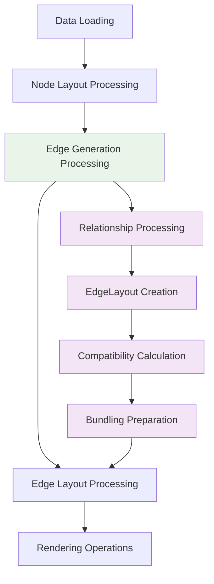

# Feature Specification: EdgeGenerator Module

**Feature Branch**: `003-edge-generator`
**Created**: 2025-11-13
**Status**: Draft
**Project**: Knowledge Network Library
**Constitution**: v1.1.0 (`.specify/memory/constitution.md`)
**Depends On**: `002-node-layout` (LayoutNode structures, spatial positioning), `001-modular-graph-engine` (functor contract, pipeline integration)

## User Scenarios & Testing *(mandatory)*

### User Story 1 - Relationship-Based Edge Generation (Priority: P1)

A data analyst needs to convert abstract relationship data from a knowledge graph into spatial edge structures that connect positioned nodes, enabling visualization of how entities relate to each other through their semantic and structural connections.

**Why this priority**: This establishes the core value proposition of the EdgeGenerator module - transforming relationship data into spatial connections that can be visualized. This capability is fundamental to making knowledge graphs comprehensible through visual edge representations.

**Independent Test**: Can be tested by loading relationship data with positioned nodes, generating edge structures, and verifying that each edge correctly references source and target nodes with proper relationship metadata preservation.

**Acceptance Scenarios**:

1. **Given** positioned nodes and relationship data, **When** edge generation processes the relationships, **Then** edge structures are created with correct source and target node references
2. **Given** relationship metadata exists, **When** edges are generated, **Then** original relationship data is preserved and accessible in EdgeLayout structures
3. **Given** malformed relationship data, **When** edge generation encounters invalid references, **Then** system provides clear error messages without disrupting valid edge creation

---

### User Story 2 - Edge Compatibility Calculation (Priority: P1) 

A visualization developer needs to calculate similarity between edges based on relationship properties and connected node characteristics, enabling intelligent edge bundling and visual clustering that reduces complexity in dense knowledge graphs.

**Why this priority**: This provides the foundation for advanced edge rendering strategies like bundling. Edge compatibility enables the system to group related edges visually, significantly improving readability in complex graphs while maintaining semantic meaning.

**Independent Test**: Can be tested by generating edges with different relationship types and node connections, calculating compatibility scores, and verifying that semantically similar edges receive higher compatibility ratings.

**Acceptance Scenarios**:

1. **Given** edges connecting similar node types, **When** compatibility is calculated, **Then** edges receive high similarity scores reflecting their semantic relationship
2. **Given** edges with different relationship properties, **When** compatibility analysis runs, **Then** scores reflect the degree of relationship similarity accurately
3. **Given** custom compatibility functions are defined, **When** edge comparison executes, **Then** results incorporate both relationship and node-based similarity factors

---

### User Story 3 - Runtime Compatibility Extension (Priority: P2)

A domain expert needs to implement custom edge compatibility functions following the established functor contract `(edgeA: EdgeLayout, edgeB: EdgeLayout, context: EdgeContext) => number`, enabling domain-specific edge grouping without modifying core generation algorithms.

**Why this priority**: This enables domain expertise integration and demonstrates the extensibility of the modular architecture. It allows the library to adapt to specialized relationship analysis while maintaining architectural consistency with established functor patterns.

**Independent Test**: Can be tested by implementing a custom edge compatibility function, registering it with the EdgeGenerator system, and verifying that edge compatibility calculations reflect the new criteria with performance remaining within established benchmarks.

**Acceptance Scenarios**:

1. **Given** a custom compatibility functor is implemented, **When** it's registered with EdgeGenerator, **Then** edge compatibility calculations reflect custom criteria within one generation cycle
2. **Given** multiple compatibility functions are registered, **When** user switches between them, **Then** compatibility scores adapt smoothly with consistent performance
3. **Given** custom compatibility function executes, **When** processing large edge sets, **Then** performance remains optimal for efficient bundling preparation

---

### User Story 4 - Bundling-Ready Edge Preparation (Priority: P2)

A performance engineer needs edge structures prepared with compatibility data that seamlessly integrates with edge bundling algorithms, enabling automatic bundling decisions based on relationship similarity without requiring separate preprocessing steps.

**Why this priority**: This ensures smooth integration with advanced rendering strategies while maintaining the modular architecture. It provides the foundation for sophisticated edge bundling without coupling edge generation to rendering concerns.

**Independent Test**: Can be tested by generating edges with compatibility data, enabling edge bundling mode, and verifying that bundling algorithms can access and utilize compatibility information for grouping decisions.

**Acceptance Scenarios**:

1. **Given** edges are generated with compatibility data, **When** bundling algorithms query edge relationships, **Then** compatibility scores are immediately available without additional processing
2. **Given** bundling is enabled, **When** edge generation completes, **Then** edges are grouped according to compatibility thresholds automatically
3. **Given** compatibility thresholds change, **When** bundling re-evaluates edge groups, **Then** grouping adapts responsively while maintaining visual stability

---

### User Story 5 - Pipeline Integration with Progress Tracking (Priority: P3)

A system integrator needs EdgeGenerator to operate seamlessly within the sequential pipeline after node layout completion, providing progress feedback and ensuring that edge generation begins only when all node positions are stable and available.

**Why this priority**: This ensures proper pipeline coordination and provides user feedback during processing. While not essential for basic functionality, it significantly improves user experience and supports the modular architecture's coordination requirements.

**Independent Test**: Can be tested by monitoring pipeline progression, verifying that edge generation waits for node layout completion, and confirming that progress events are emitted during edge processing phases.

**Acceptance Scenarios**:

1. **Given** node layout is in progress, **When** edge generation is triggered, **Then** edge processing waits until all node positions are finalized
2. **Given** edge generation begins, **When** processing large relationship sets, **Then** progress events provide meaningful feedback on generation phases
3. **Given** edge generation completes, **When** rendering pipeline queries edge data, **Then** all edges are available with complete compatibility information

---

### Edge Cases

- How does the system handle relationships referencing non-existent nodes after layout processing?
- What occurs when custom compatibility functions fail or timeout during edge processing?
- How does the system manage memory when generating edges using batch processing with configurable chunk sizes for very dense graphs with high relationship counts?
- What happens when custom compatibility functions fail or timeout during edge processing?
- How does the system behave when relationship data changes while edge generation is in progress?

## Requirements *(mandatory)*

### Functional Requirements

- **FR-001**: System MUST generate EdgeLayout structures from relationship data that reference LayoutNode instances from node layout processing, with explicit ID mapping contract where `relationship.sourceId` and `relationship.targetId` map to `layoutNode.id` values *(extends [`002-node-layout#FR-012`](../002-node-layout/spec.md) LayoutNode architecture)*
- **FR-002**: System MUST preserve original relationship data in EdgeLayout structures while adding generation-specific metadata *(coordinates with [`001-modular-graph-engine#FR-001`](../001-modular-graph-engine/spec.md) layout/rendering separation)*
- **FR-003**: System MUST calculate edge compatibility using configurable functions following CompatibilityFunctor contract `(edgeA: EdgeLayout, edgeB: EdgeLayout, context: EdgeContext) => number` *(coordinated by [`001-modular-graph-engine#FR-004`](../001-modular-graph-engine/spec.md) runtime extensibility)*
- **FR-004**: System MUST support runtime registration of custom compatibility functions without system restart *(coordinated by [`001-modular-graph-engine#FR-004`](../001-modular-graph-engine/spec.md) runtime extensibility)*
- **FR-005**: System MUST operate in the sequential pipeline after node layout completion and before rendering operations *(orchestrated by [`001-modular-graph-engine#FR-003`](../001-modular-graph-engine/spec.md) pipeline processing)*
- **FR-006**: System MUST provide compatibility data suitable for edge bundling algorithms without coupling to specific bundling implementations *(coordinated with [`001-modular-graph-engine#FR-002`](../001-modular-graph-engine/spec.md) pluggable rendering strategies)*
- **FR-007**: System MUST handle invalid relationship references gracefully with detailed error reporting while continuing processing of valid relationships
- **FR-008**: System MUST support both simple edge generation (source/target only) and complex edge generation (with full compatibility analysis) based on configuration
- **FR-009**: System MUST provide progress events for edge generation phases including relationship processing, compatibility calculation, and edge structure creation
- **FR-010**: System MUST optimize edge generation algorithms for responsive processing of large relationship datasets using adaptive batch processing that starts with 1000 relationships per chunk and adjusts based on available memory and processing time, with best-effort timing optimized for responsive feel *(aligns with [`001-modular-graph-engine#SC-001`](../001-modular-graph-engine/spec.md) performance requirements)*
- **FR-011**: System MUST create immutable EdgeLayout structures that reference original relationship data while storing generation-specific metadata and compatibility scores
- **FR-012**: System MUST provide configurable ID generation for EdgeLayout instances through functions that generate IDs given relationship and context data
- **FR-013**: System MUST handle custom compatibility function failures or timeouts by automatically switching to built-in default compatibility functions while logging error details for debugging
- **FR-014**: System MUST calculate dynamic compatibility thresholds based on edge distribution and dataset characteristics for automatic bundling decisions rather than using fixed threshold values
- **FR-015**: System MUST buffer incoming relationship data changes during active edge generation processing and apply buffered changes only after current generation cycle completes to maintain processing stability

### Key Entities *(include if feature involves data)*

- **EdgeLayout**: Immutable edge structure with unique identifier containing references to source and target LayoutNodes, original relationship data, compatibility scores, and generation metadata. Ensures strict separation between original relationship data and generation-specific information
- **Relationship Data**: Original relationship information including source/target identifiers, relationship type, properties, and metadata that forms the basis for edge generation
- **Edge Compatibility Function**: CompatibilityFunctor implementation following contract `(edgeA: EdgeLayout, edgeB: EdgeLayout, context: EdgeContext) => number` for calculating edge compatibility *(coordinated by [`001-modular-graph-engine`](../001-modular-graph-engine/spec.md) functor contract)*
- **Edge Generation Configuration**: Parameters defining compatibility weighting, processing modes, bundling preparation settings, and performance optimization options *(orchestrated by [`001-modular-graph-engine`](../001-modular-graph-engine/spec.md) pipeline coordination)*
- **Edge Context**: Runtime state including current compatibility calculations, relationship metadata, and spatial indexing for efficient edge processing *(orchestrated by [`001-modular-graph-engine`](../001-modular-graph-engine/spec.md) pipeline processing context)*
- **Generation Progress**: Progress tracking including relationship processing counts, compatibility calculation timing, and edge structure creation status

## Scope & Boundaries *(mandatory)*

### What's Included
- Edge structure generation from relationship data with LayoutNode references
- Edge compatibility calculation algorithms with configurable similarity functions
- Runtime extensibility for custom compatibility functions following established functor contracts
- Integration with sequential pipeline processing after node layout completion
- Progress tracking and event emission for generation phases
- Support for both simple and complex edge generation modes based on configuration
- Memory-efficient processing for large relationship datasets using batch processing with configurable chunk sizes

### What's Excluded
- Edge rendering and visual representation (handled by rendering engines)
- Edge bundling algorithm implementation (handled by edge bundling systems)
- Relationship data preprocessing and validation (handled by data management layer)
- Node positioning and layout operations (handled by node layout systems)
- User interaction handling beyond edge data queries (handled by interaction systems)
- Persistence and serialization of edge results (handled by state management)
- Network topology analysis beyond relationship-based connections

### Feature Boundaries
- **Edge Generation**: Focuses on data structure creation, not visual representation
- **Compatibility Processing**: Handles compatibility function execution, not similarity algorithm development
- **Pipeline Coordination**: Manages generation sequencing, not overall pipeline orchestration

## Dependencies & Assumptions *(mandatory)*

### External Dependencies
- **Node Layout Module**: LayoutNode structures and spatial positioning from [`002-node-layout`](../002-node-layout/spec.md) specification
- **Modular Graph Engine**: Functor contract compliance, pipeline integration, and builder pattern compatibility from [`001-modular-graph-engine`](../001-modular-graph-engine/spec.md) specification
- **Mathematical Libraries**: Support for similarity calculations, statistical functions, and compatibility scoring
- **Performance APIs**: Browser timing interfaces for progress tracking and optimization
- **Memory Management**: Efficient edge storage for large relationship datasets

### System Assumptions
- **Relationship Data Quality**: Input relationships contain valid node references and sufficient metadata for compatibility calculations
- **Node Layout Completion**: LayoutNode structures are available and stable before edge generation begins
- **Performance Context**: Client-side processing adequate for target relationship dataset sizes with available memory
- **Integration Environment**: Host systems provide necessary execution context for functor-based extensibility

### Integration Requirements
- **Functor Interface**: Compliance with `(edgeA: EdgeLayout, edgeB: EdgeLayout, context: EdgeContext) => number` contract
- **Pipeline Coordination**: Integration with sequential processing model requiring node layout completion
- **Performance Monitoring**: Integration with system performance APIs for generation timing and optimization
- **Memory Constraints**: Scalable edge storage with efficient memory usage for large edge datasets including compatibility data

### Risk Factors
- **Compatibility Computation Complexity**: Custom compatibility functions may impact performance beyond target thresholds
- **Relationship Dataset Size**: Large relationship counts may require memory optimization and progressive processing
- **Pipeline Coordination Complexity**: Dependencies on node layout completion may introduce coordination challenges
- **Integration Complexity**: Custom compatibility implementations require understanding of functor contract and edge context

## Success Criteria *(mandatory)*

### Measurable Outcomes

- **SC-001**: Edge generation from relationship data completes initial processing efficiently for typical datasets *(supports [`001-modular-graph-engine#SC-005`](../001-modular-graph-engine/spec.md) performance improvement through pipeline processing)*
- **SC-002**: Full edge generation including compatibility calculation completes efficiently for large datasets *(aligns with [`001-modular-graph-engine#SC-001`](../001-modular-graph-engine/spec.md) performance requirements)*
- **SC-003**: Custom edge compatibility functions integrate with minimal implementation code (fewer than 50 lines) and execute efficiently *(implements [`001-modular-graph-engine#SC-003`](../001-modular-graph-engine/spec.md) custom similarity measures)*
- **SC-004**: Edge compatibility calculations maintain high accuracy with correlation > 85% between semantic similarity and calculated compatibility scores
- **SC-005**: Pipeline coordination ensures edge generation waits appropriately for node layout completion while providing responsive progress feedback
- **SC-006**: Memory usage scales efficiently with edge count, remaining manageable for large graphs *(supports [`001-modular-graph-engine#SC-007`](../001-modular-graph-engine/spec.md) graceful degradation strategies)*
- **SC-007**: Edge structures integrate seamlessly with bundling algorithms, enabling automatic bundling decisions without additional preprocessing *(enables [`001-modular-graph-engine#SC-002`](../001-modular-graph-engine/spec.md) rendering strategy switching)*
- **SC-008**: Generation error handling maintains system stability with detailed error reporting for invalid relationships while continuing processing of valid data

## Implementation Architecture *(following modular graph engine patterns)*

### Core Components

#### EdgeGenerationEngine
**Responsibility**: Orchestrate edge structure creation and coordinate compatibility-based processing
**Functor Integration**: Accept and execute compatibility functors following `(edgeA, edgeB, context) => number` contract
**Key Methods**:
- `generateEdges(relationships: Relationship[], layoutNodes: LayoutNode[], config: EdgeGenerationConfig): Promise<EdgeLayout[]>`
- `calculateCompatibility(edges: EdgeLayout[], compatibilityFunctor: CompatibilityFunctor): Promise<CompatibilityMatrix>`
- `registerCompatibilityFunctor(name: string, functor: CompatibilityFunctor): void`

#### RelationshipProcessor
**Responsibility**: Convert relationship data into EdgeLayout structures with proper node references
**Integration Points**: Coordinate with LayoutNode structures from node layout module
**Key Methods**:
- `processRelationships(relationships: Relationship[], layoutNodes: Map<string, LayoutNode>): EdgeLayout[]`
- `validateRelationshipReferences(relationships: Relationship[], availableNodes: Set<string>): ValidationResult`
- `createEdgeLayout(relationship: Relationship, sourceNode: LayoutNode, targetNode: LayoutNode): EdgeLayout`

#### CompatibilityProcessor
**Responsibility**: Execute edge compatibility calculations and manage custom functor integration
**Functor Contract**: Implement runtime registration and execution of `(edgeA, edgeB, context) => number` functions
**Key Methods**:
- `calculatePairwiseCompatibility(edgeA: EdgeLayout, edgeB: EdgeLayout, functor: CompatibilityFunctor): number`
- `buildCompatibilityMatrix(edges: EdgeLayout[], functor: CompatibilityFunctor): CompatibilityMatrix`
- `validateFunctorOutput(compatibility: number, edgeA: EdgeLayout, edgeB: EdgeLayout): number`

## Composition with Modular Graph Engine *(architectural integration)*

The EdgeGenerator module operates as the third stage in the modular graph engine pipeline established in [`001-modular-graph-engine`](../001-modular-graph-engine/spec.md), following the node layout processing from [`002-node-layout`](../002-node-layout/spec.md). This composition ensures architectural consistency while enabling relationship-based edge generation capabilities.

### Architectural Integration Points

#### Sequential Pipeline Coordination
**Pipeline Position**: EdgeGenerator operates after node layout completion and before rendering:



**Benefits**:
- Respects [`001-modular-graph-engine#FR-003`](../001-modular-graph-engine/spec.md) sequential processing requirements
- Leverages stable LayoutNode positions from [`002-node-layout`](../002-node-layout/spec.md) for reliable edge generation
- Provides compatibility data for subsequent edge bundling and rendering operations

#### Functor Contract Compliance
**Implementation**: All compatibility functions strictly adhere to the established functor contract:
```typescript
type CompatibilityFunctor = (edgeA: EdgeLayout, edgeB: EdgeLayout, context: EdgeContext) => number;
```

**Integration Benefits**:
- Seamless runtime registration compatible with [`001-modular-graph-engine#FR-004`](../001-modular-graph-engine/spec.md)
- Consistent extensibility patterns across all system components
- Type-safe compatibility function composition and validation

### Performance Alignment Matrix

| Metric | Modular Engine Requirement | EdgeGenerator Implementation |
|--------|---------------------------|------------------------------|
| Processing Speed | [`SC-001`](../001-modular-graph-engine/spec.md): Efficient for 1000 nodes | **SC-001**: Efficient generation for typical datasets |
| Runtime Extensibility | [`SC-003`](../001-modular-graph-engine/spec.md): Minimal custom code | **SC-003**: Concise compatibility functions |
| Memory Scaling | [`SC-007`](../001-modular-graph-engine/spec.md): Graceful degradation | **SC-006**: Efficient edge storage |

## Testing Strategy

### Unit Testing
- Edge generation from relationship data with proper node reference validation
- Compatibility function execution and functor contract compliance  
- Edge structure creation accuracy and metadata preservation
- Custom compatibility function integration and performance validation
- Error handling for invalid relationships and malformed data

### Integration Testing
- End-to-end edge generation workflows with various relationship configurations
- Pipeline coordination with node layout module dependencies
- Performance benchmarking across different relationship dataset sizes and complexities
- Compatibility with edge bundling algorithms and rendering strategies
- Memory usage profiling for large-scale relationship processing

### Performance Testing
- Edge generation timing across target dataset sizes
- Compatibility calculation performance with custom functors
- Progressive generation responsiveness and feedback accuracy
- Pipeline coordination efficiency and waiting behavior

## Future Considerations

### Potential Extensions
- GPU-accelerated compatibility calculations for massive relationship datasets
- Advanced relationship analysis with hierarchical compatibility scoring
- Dynamic compatibility function composition and weighting systems
- Integration with machine learning pipelines for relationship similarity learning
- Distributed edge generation for enterprise-scale knowledge graphs

### Scalability Improvements
- WebWorker-based parallel compatibility processing
- Incremental edge updates for streaming relationship data integration
- Adaptive algorithm selection based on relationship characteristics and performance requirements
- Advanced memory management strategies for large-scale edge storage
- Optimized spatial indexing for efficient compatibility calculations

## Clarifications *(added during specification review)*

### Session 2025-11-13

- Q: What specific performance timing targets should the EdgeGenerator meet to ensure predictable user experience across different dataset sizes? → A: Best-effort timing: No specific targets, optimize for "responsive feel"
- Q: How should the system handle compatibility function results outside the expected [0,1] range to prevent bundling algorithm failures? → A: Normalize to [0,1] automatically
- Q: What memory management strategy should EdgeGenerator use for processing very large relationship datasets to prevent browser memory issues? → A: Batch processing with configurable chunk sizes
- Q: How should the EdgeGenerator determine optimal chunk sizes for batch processing different relationship dataset sizes and complexity levels? → A: Adaptive sizing: Start with 1000 relationships per chunk, adjust based on available memory and processing time
- Q: How should the system handle custom compatibility function failures or timeouts during edge processing? → A: Use fallback default: Switch to built-in compatibility function when custom function fails
- Q: What compatibility threshold values should be used for automatic bundling decisions when edges are grouped according to compatibility thresholds? → A: Dynamic thresholds: Calculate based on edge distribution and dataset characteristics
- Q: How should the system behave when relationship data changes while edge generation is in progress? → A: Queue updates: Buffer incoming changes and apply after current generation completes

### CL-001: Default Edge Compatibility Functions
**Question**: What default compatibility functions should the system provide to handle different relationship scenarios while ensuring the library works immediately upon installation?

**Answer**: Implement relationship-type-first compatibility with intelligent fallbacks:
- **Primary**: Relationship type similarity for edges with matching `relationship.type` properties
- **Secondary**: Node similarity propagation using compatibility between connected nodes
- **Tertiary**: Spatial proximity compatibility based on edge geometry and node positions
- **Auto-selection**: System automatically chooses appropriate function based on available relationship data

**Default Function Cascade**:
```typescript
defaultCompatibility(edgeA, edgeB, context) {
  if (edgeA.type && edgeB.type) return relationshipTypeSimilarity(edgeA.type, edgeB.type);
  if (edgeA.sourceNode && edgeB.sourceNode) return nodeSimilarityPropagation(edgeA, edgeB, context);
  return spatialProximityCompatibility(edgeA.geometry, edgeB.geometry);
}
```

**Impact**:
- Ensures immediate functionality without requiring custom compatibility configuration
- Maximizes compatibility quality by using best available relationship data
- Supports mixed graphs with heterogeneous relationship types seamlessly
- Provides meaningful compatibility even for minimal relationship data (just source/target)

### CL-002: EdgeLayout Immutable Architecture
**Question**: How should the EdgeGenerator maintain strict separation between original relationship data and generation-specific information while ensuring data immutability?

**Answer**: Implement EdgeLayout wrapper architecture that preserves original relationship integrity:
- **EdgeLayout Structure**: Create immutable edge wrappers that reference (not copy) original relationship data
- **Generation Metadata Separation**: Store compatibility scores, bundling flags, and processing state in EdgeLayout, not original Relationship
- **Immutable References**: Original relationship data remains completely unmodified throughout generation operations
- **Clean State Management**: Generation calculations work with EdgeLayout structures, bundling consumes EdgeLayout.compatibility

**EdgeLayout Structure**:
```typescript
interface EdgeLayout {
  readonly id: string;
  readonly relationship: Relationship; // Immutable reference to original
  readonly sourceNode: LayoutNode;
  readonly targetNode: LayoutNode;
  readonly compatibility: CompatibilityScores;
  readonly metadata: EdgeGenerationMetadata;
}
```

**Impact**:
- Preserves original relationship data integrity throughout processing
- Enables clean separation between source data and generation artifacts
- Supports efficient memory usage through reference-based architecture
- Facilitates debugging and testing through clear data lineage
- Maintains consistency with LayoutNode patterns from node layout module

### CL-003: Compatibility Matrix Optimization Strategy
**Question**: How should the system optimize compatibility calculations to meet performance targets while maintaining calculation quality?

**Answer**: Implement progressive compatibility calculation with intelligent sampling:
- **Spatial Sampling**: Use spatial indexing to limit compatibility calculations to spatially proximate edges
- **Type-Based Grouping**: Pre-group edges by relationship type to optimize homogeneous compatibility calculations
- **Progressive Calculation**: Start with subset for initial bundling decisions, expand based on performance availability
- **Compatibility Caching**: Cache computed compatibility results with invalidation on relationship changes

**Performance Architecture**:
- Phase 1: Calculate compatibility for high-priority edge pairs (same type, spatial proximity)
- Phase 2: Progressive expansion using spatial and type-based heuristics
- Ongoing: Cache-first compatibility lookup with background cache warming

**Impact**:
- Meets performance requirements for efficient processing
- Reduces compatibility calculations from O(n²) to O(n log n) through intelligent sampling
- Maintains compatibility quality through prioritized calculation and progressive refinement
- Supports real-time bundling decisions with early compatibility availability

### CL-004: Pipeline Synchronization and Progress Events
**Question**: How should EdgeGenerator coordinate with the pipeline to ensure proper sequencing and provide meaningful progress feedback?

**Answer**: Implement event-driven pipeline coordination with detailed progress tracking:
- **Pipeline Events**: Listen for `nodeLayoutComplete` events before beginning edge generation
- **Generation Events**: Emit `edgeGenerationProgress` events with detailed phase information
- **Completion Signaling**: Emit `edgeGenerationComplete` event to trigger next pipeline stage
- **Error Coordination**: Provide pipeline-aware error handling with recovery options

**Event Architecture**:
```typescript
interface EdgeGenerationProgressEvent {
  type: 'edgeGenerationProgress' | 'edgeGenerationComplete';
  progress: number; // 0-100 percentage
  phase: 'processing' | 'compatibility' | 'bundling-prep' | 'complete';
  edgesProcessed: number;
  totalEdges: number;
  compatibilityCalculated: number;
  timeElapsed: number;
}
```

**Impact**:
- Ensures reliable pipeline sequencing with node layout dependencies
- Provides granular progress feedback for user interface updates
- Enables cancellation and error recovery for long-running operations
- Supports performance monitoring and optimization through detailed timing data
- Aligns with sequential processing requirements from modular engine architecture